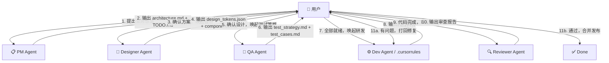

# Agent 编排协议 (Orchestration Protocol)

本文档定义了各 Agent 角色之间的协作流程、交接规范和数据契约。
用户作为唯一的"调度者 (Orchestrator)"，负责在 Agent 之间传递上下文和裁决争议。

---

## 🔀 标准协作流程



---

## 📦 各 Agent 的输入/输出契约

### PM Agent (`pm_agent.md`)
| 方向 | 内容 | 格式 |
|------|------|------|
| **输入** | 用户的业务想法/需求描述 | 自然语言 |
| **输出 A** | 架构与业务上下文 | 覆盖 `docs/architecture.md` |
| **输出 B** | 研发任务清单 | 追加到 `TODO.md` |

### Designer Agent (`designer_agent.md`)
| 方向 | 内容 | 格式 |
|------|------|------|
| **输入** | `docs/architecture.md` + `TODO.md` | Markdown |
| **输出 A** | 设计代币 | 覆盖 `docs/design/design_tokens.json` |
| **输出 B** | 组件规格说明 | 追加到 `docs/design/components.md` |

### QA Agent (`qa_agent.md`)
| 方向 | 内容 | 格式 |
|------|------|------|
| **输入** | `docs/architecture.md` + `TODO.md` | Markdown |
| **输出 A** | 测试策略 + 质量门禁 | 创建/更新 `docs/test_strategy.md` |
| **输出 B** | 测试用例矩阵 | 创建/更新 `docs/test_cases.md` |
| **输出 C** | 测试任务 | 追加到 `TODO.md` |

### Dev Agent (`.cursorrules`)
| 方向 | 内容 | 格式 |
|------|------|------|
| **输入** | 所有 `docs/` 文档 + `TODO.md` + `MEMORY.md` | Markdown + JSON |
| **输出** | 可运行的代码实现 | 源代码文件 |

### Reviewer Agent (`reviewer_agent.md`)
| 方向 | 内容 | 格式 |
|------|------|------|
| **输入** | 被审查的代码文件 + `docs/architecture.md` + `TODO.md` | 源代码 + Markdown |
| **输出** | 结构化审查报告 | Markdown (含表格) |

---

## 🔄 迭代循环规则

### 正常流转
1. 每个 Agent 完成输出后，**必须提示用户进行下一步操作**（例如："请将上述内容更新至文档，并唤起下一个 Agent"）。
2. 用户是唯一有权决定"跳过某个 Agent"的人（例如：纯后端项目可跳过 Designer）。

### 打回与修复
1. Reviewer 打回后，用户将审查报告转交 Dev Agent，Dev 修复后再次提交审查。
2. **最多循环 3 轮**。第 3 轮仍未通过，Reviewer 必须输出"建议重新设计"并 @PM Agent 介入。

### 争议升级
1. 任何两个 Agent 之间的分歧，必须各自给出**具体的数据用例或代码示例**来支撑观点。
2. 用户作为最终裁决者，选择采纳哪一方的方案。

---

## 📁 文件系统契约 (File Convention)

所有 Agent 共同维护的文件结构：

```
project-root/
├── .cursorrules              # Dev Agent 全局规则 (常驻)
├── .prompts/                 # Agent 角色模板
│   ├── orchestration.md      # 本文档 (编排协议)
│   ├── pm_agent.md           # PM 角色
│   ├── designer_agent.md     # Designer 角色
│   ├── qa_agent.md           # QA 角色
│   └── reviewer_agent.md     # Reviewer 角色
├── docs/
│   ├── architecture.md       # 系统架构 (PM 输出，全员消费)
│   ├── design/
│   │   ├── design_tokens.json # 设计代币 (Designer 输出)
│   │   └── components.md      # 组件规格 (Designer 输出)
│   ├── test_strategy.md      # 测试策略 (QA 输出)
│   └── test_cases.md         # 测试用例 (QA 输出)
├── MEMORY.md                 # 项目记忆 (全员可追加)
└── TODO.md                   # 任务清单 (PM/QA 追加，Dev 消费并清理)
```

---

## ⚡ 快速唤起指令

在 IDE 中切换 Agent 角色时，可使用以下指令模板：

- **唤起 PM**：`请切换到 PM 角色 (@pm_agent.md)，我有一个新的业务想法需要推敲。`
- **唤起 Designer**：`请切换到 Designer 角色 (@designer_agent.md)，architecture.md 和 TODO.md 已就绪，请输出设计方案。`
- **唤起 QA**：`请切换到 QA 角色 (@qa_agent.md)，请根据当前架构输出测试策略和用例矩阵。`
- **唤起 Reviewer**：`请切换到 Reviewer 角色 (@reviewer_agent.md)，请审查以下文件：[文件列表]。`

> **注意**：当 `.cursorrules` 中的"智能角色路由"生效时，大多数情况下无需手动唤起。
> AI 会根据你的消息意图自动匹配角色，并在回复开头用 `[🎭 角色名]` 标注。
> 仅在 AI 判断错误或你需要强制切换时，才使用上述显式指令。
