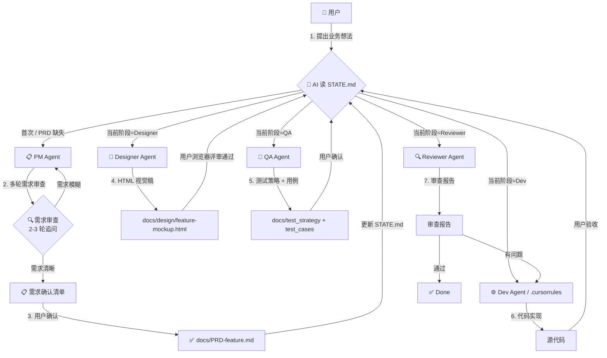

# Agent 编排协议 (Orchestration Protocol)

本文档定义 Agent 角色之间的协作流程、交接规范与数据契约。

> **核心调度模式（v2 重要变更）**
>
> 旧版（v1）：用户作为唯一调度者，手动在 Agent 之间传递上下文。
> 新版（v2）：**`docs/STATE.md` 是 single source of truth**，AI 根据 STATE.md 自动决定激活哪个角色，用户只在产物评审/争议裁决时介入。
>
> 这一变更是为了消除"每次提问都得先想清楚找谁"的认知负担。

---

## 🔀 标准协作流程


```mermaid
flowchart TD
    User[👤 用户] -->|1. 提出业务想法| AI{🤖 AI 读 STATE.md}
    AI -->|首次 / PRD 缺失| PM[📋 PM Agent]
    PM -->|2. 多轮需求审查| Review{🔍 需求审查\n2-3 轮追问}
    Review -->|需求模糊| PM
    Review -->|需求清晰| Checklist[📋 需求确认清单]
    Checklist -->|3. 用户确认| PRD[✅ docs/PRD-feature.md]
    PRD -->|更新 STATE.md| AI

    AI -->|当前阶段=Designer| Designer[🎨 Designer Agent]
    Designer -->|4. HTML 视觉稿| Mockup[docs/design/feature-mockup.html]
    Mockup -->|用户浏览器评审通过| AI

    AI -->|当前阶段=QA| QA[🧪 QA Agent]
    QA -->|5. 测试策略 + 用例| TestDocs[docs/test_strategy + test_cases]
    TestDocs -->|用户确认| AI

    AI -->|当前阶段=Dev| Dev[⚙️ Dev Agent / .cursorrules]
    Dev -->|6. 代码实现| Code[源代码]
    Code -->|用户验收| AI

    AI -->|当前阶段=Reviewer| Reviewer[🔍 Reviewer Agent]
    Reviewer -->|7. 审查报告| Report[审查报告]
    Report -->|有问题| Dev
    Report -->|通过| Done[✅ Done]
```

> **⚠️ 执行门禁（v2）**：
> 1. **目标未锚定**：`architecture.md` 业务目标为占位符 → 强制 Goal Discovery（PM Agent）
> 2. **PRD 未确认**：用户未确认需求清单 → 任何 Agent 禁止写实现代码
> 3. **跨阶段意图**：用户提的问题对应的 Agent 与 STATE.md 当前阶段不一致 → AI 必须显式询问"先走完当前阶段，还是跳过？"

---

## 📦 各 Agent 的输入/输出契约

### PM Agent (`pm_agent.md`)
| 方向 | 内容 | 格式 |
|------|------|------|
| **输入** | 用户的业务想法 / 需求描述 | 自然语言 |
| **中间产物** | 需求确认清单 (Checklist) | 结构化 Markdown |
| **门禁** | 用户逐项确认 | 用户回复 |
| **输出 A** | `docs/PRD-<feature>.md` | 单需求 PRD（包含场景、边界、验收标准） |
| **输出 B** | `docs/architecture.md` 增量更新 | 仅当涉及系统级架构变更时才动 |
| **输出 C** | `TODO.md` 任务追加 + STATE.md 状态更新 | 勾选 PM 阶段，激活 Designer |

### Designer Agent (`designer_agent.md`)
| 方向 | 内容 | 格式 |
|------|------|------|
| **输入** | `docs/PRD-<feature>.md` + 既有 design 资产 | Markdown + HTML/CSS |
| **输出 A** | `docs/design/<feature>-mockup.html` | **自包含 HTML 视觉稿**（CSS 内联，浏览器直开） |
| **输出 B** | `docs/design/<feature>-design-notes.md` | 设计决策、组件清单、交互流程、边界处理 |
| **门禁** | 用户在浏览器评审 mockup.html | 用户回复"设计确认" |

> **重要**：Designer 不再输出 `design_tokens.json` 作为唯一产物。
> HTML 视觉稿才是与下游 Dev Agent 对接的最自然契约——Dev 可以直接复用 HTML 中的结构与 class 命名。

### QA Agent (`qa_agent.md`)
| 方向 | 内容 | 格式 |
|------|------|------|
| **输入** | `docs/PRD-<feature>.md` + `docs/design/<feature>-mockup.html`（如有） | Markdown + HTML |
| **输出 A** | `docs/test_strategy-<feature>.md` | 测试金字塔、工具选型、质量门禁 |
| **输出 B** | `docs/test_cases-<feature>.md` | 用例矩阵（正向/边界/异常） |
| **输出 C** | `TODO.md` 测试任务追加 + STATE.md 状态更新 | 勾选 QA 阶段，激活 Dev |

### Dev Agent (`.cursorrules`)
| 方向 | 内容 | 格式 |
|------|------|------|
| **输入** | `docs/PRD-<feature>.md` + `docs/design/<feature>-*.html` + `docs/test_cases-<feature>.md` + `MEMORY.md` | Markdown + HTML + JSON |
| **输出** | 可运行的代码 + 单元测试 | 源代码 |
| **门禁** | 单元测试全绿、自验通过 | 自动 |

### Reviewer Agent (`reviewer_agent.md`)
| 方向 | 内容 | 格式 |
|------|------|------|
| **输入** | 被审查代码 + `docs/PRD-<feature>.md` + `docs/test_cases-<feature>.md` | 源代码 + Markdown |
| **输出** | 结构化审查报告 → `docs/reviews/<feature>-<date>.md` | Markdown |

---

## 🚦 状态调度协议（v2 核心）

### AI 在每次回复前必须做的三步

```
1. 读 docs/STATE.md（如不存在 → 默认激活 PM Agent 引导用户从需求开始）
2. 找出 **当前阶段** 标记所在的 Agent
3. 比对用户消息意图：
   ├─ 一致 → 直接以该 Agent 回应（回复开头标 [🎭 角色名]）
   ├─ 跨阶段 → 反问用户（见下方话术）
   └─ 单点修复 / 文档 / 格式化 → 不走流程，直接动手（豁免规则）
```

### 跨阶段反问话术模板

```
当前流程在 [X 阶段]，[Y 产物] 还没就绪。
你的问题更像是 [Z 阶段] 的工作。三个选择：

A) 先把 [X] 走完（建议，避免下游返工）
B) 跳过 [X] 直接做 [Z]（风险：...）
C) 推翻当前流程，从需求重新审查

选哪个？或告诉我你的判断，我据此更新 STATE.md。
```

### 豁免清单（不走流程，AI 直接动手）

- 单文件 Bug 修复（明确的报错 + 明确的修复点）
- 文档更新、注释修改、Typo
- 格式化、Lint 修复
- 用户明确说"跳过审查" / "直接执行" / "全干" / "你来"
- 用户在询问而非要求执行（"这个怎么做"、"为什么会这样"）

---

## 🔄 迭代循环规则

### 需求审查阶段（强制）
1. PM Agent 收到需求 → 必须 2-3 轮结构化追问
2. 输出 `docs/PRD-<feature>.md` 后，用户逐项确认
3. **门禁**：用户确认前禁止任何 Agent 写实现代码
4. 豁免：见上方"豁免清单"

### 正常流转
1. 每个 Agent 完成产物后，**必须输出交接块**（Handoff Block，见下方）
2. 用户确认后，AI 更新 STATE.md（勾选完成阶段，激活下一阶段）
3. 下一次对话开始时，AI 自动从 STATE.md 接手，不需要用户重新指定角色

### 打回与修复
1. Reviewer 打回 → 用户将报告转交 Dev → Dev 修复 → 再审查
2. 最多循环 3 轮。第 3 轮仍未通过 → Reviewer 必须建议"重新设计" → @PM Agent
3. 如果 Designer/Dev 在做事时发现上游产物有缺 → **必须打回上游**，禁止自行脑补

### 争议升级
- 任何两个 Agent 之间的分歧 → 双方必须各自给出**具体的数据用例或代码示例**
- 用户作为最终裁决者，选择采纳哪一方

---

## 🔁 显式交接块 (Handoff Block) 标准格式

每个 Agent 完成产物后，必须在回复末尾输出：

```markdown
## 🔄 交接 (Handoff) — [当前角色] → 下一阶段

- **本阶段产出**: <产物文件路径列表>
- **请用户操作**: <用户需要做什么才能确认>
- **建议下一步**: <下一个 Agent 名>（理由）
- **可跳过条件**: <什么情况下跳过下一阶段也合理>
- **STATE.md 更新指令**: <用户确认后，AI 应该如何更新 STATE.md>
```

> 这个块是机器可读的——下次对话开始时，AI 读 STATE.md + 上一次的交接块即可无缝接手，
> 不需要用户重复解释上下文。

---

## 📁 文件系统契约

```
project-root/
├── .cursorrules              # Dev Agent 全局规则 + 路由（含状态调度）
├── .prompts/                 # Agent 角色模板
│   ├── orchestration.md      # 本文档（编排协议 v2）
│   ├── pm_agent.md           # PM
│   ├── designer_agent.md     # Designer ✨ v2 新增
│   ├── qa_agent.md           # QA
│   └── reviewer_agent.md     # Reviewer
├── docs/
│   ├── STATE.md              # ✨ v2 新增：流程状态机（single source of truth）
│   ├── PRD-<feature>.md      # ✨ v2 新增：单需求 PRD（PM 输出）
│   ├── architecture.md       # 系统架构（仅架构级变更才动）
│   ├── design/
│   │   ├── <feature>-mockup.html       # ✨ v2 改：HTML 视觉稿（Designer 输出）
│   │   ├── <feature>-design-notes.md   # 设计说明（Designer 输出）
│   │   ├── design_tokens.json          # （可选）跨需求复用的 token
│   │   └── components.md               # （可选）组件库索引
│   ├── test_strategy-<feature>.md  # 测试策略（QA 输出）
│   ├── test_cases-<feature>.md     # 测试用例（QA 输出）
│   └── reviews/<feature>-<date>.md # 审查报告（Reviewer 输出）
├── MEMORY.md                 # 项目记忆（全员可追加）
└── TODO.md                   # 任务清单
```

---

## ⚡ 快速唤起指令（仅在状态调度失效时使用）

正常情况下，AI 应根据 STATE.md 自动激活角色。仅当 AI 路由错误或你需要强制切换时，使用以下显式指令：

- **强制切到 PM**：`@pm_agent.md 我有新需求要从头审查`
- **强制切到 Designer**：`@designer_agent.md PRD 已就绪请出 HTML 视觉稿`
- **强制切到 QA**：`@qa_agent.md 请基于当前 PRD + 视觉稿出测试用例`
- **强制切到 Reviewer**：`@reviewer_agent.md 请审查以下文件：[文件列表]`
- **强制切到 Dev**：`@dev 直接开始实现，跳过流程`

---

## 🔍 Migration Note (v1 → v2)

如果你的项目里之前用的是 v1 流程：

1. 在 `docs/` 下创建 `STATE.md`（参考 `STATE.template.md`）
2. 把已有的 `architecture.md` 中的需求段落抽出来，建 `PRD-<feature>.md`
3. 如果 design 产物是 JSON tokens，**保留**它们作为跨需求复用资产；新需求按 v2 走 HTML mockup
4. `.cursorrules` 中的"角色路由"段落已升级为"状态调度"，无需手动改动
