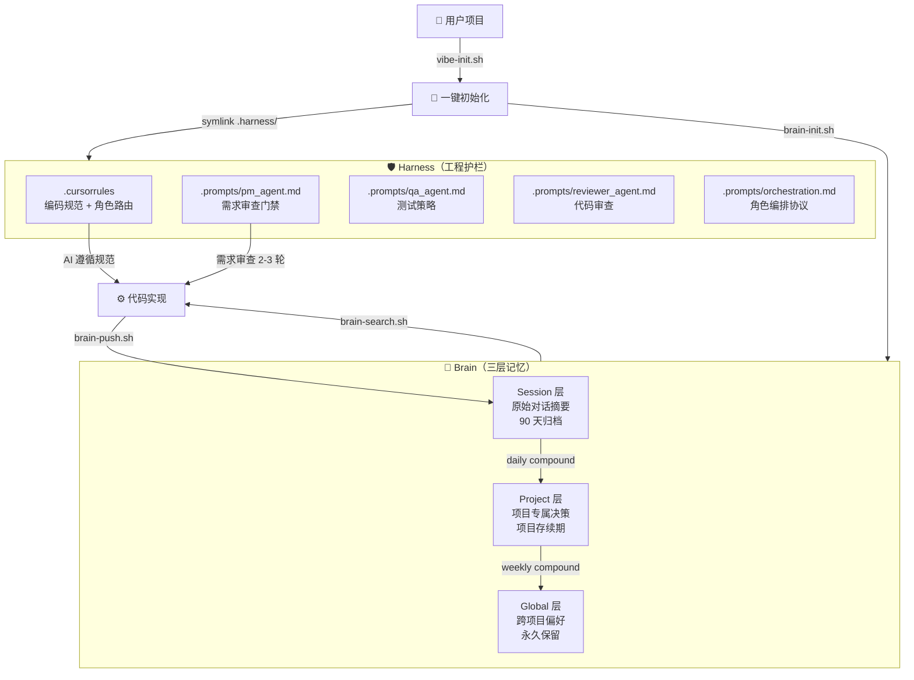

# Mick Harness Rules

一套可被 N 个项目复用的 Vibe Coding 脚手架 + 三层记忆系统。

引入即生效。不侵入项目代码，不污染项目仓库。

它围绕两个核心能力展开：

- **Harness（工程护栏）**
  - `.cursorrules` 全局编码规范
  - 多 Agent 角色协作（PM / Designer / QA / Reviewer / Dev）
  - 强制需求审查门禁
  - Git 工作流 + CI/CD 护栏
- **Brain（三层记忆）**
  - `brain/global/` — 跨项目通用偏好与经验，永久保留
  - `brain/projects/` — 项目专属上下文与决策，保留项目存续期
  - `brain/sessions/` — 每次对话的原始摘要，90 天自动归档
  - 蒸馏流程：Session → Project → Global
  - 基于 ripgrep 的检索优先策略

## 这个项目解决什么问题

Vibe Coding 场景下，AI 编码助手普遍存在三个问题：

1. **没有规范** — AI 写出的代码风格不一致，没有防御性编程，没有 TDD，没有架构约束
2. **没有记忆** — 每次对话都是从零开始，之前踩过的坑、做过的决策全部丢失
3. **没有流程** — 需求模糊就直接开始写代码，没有审查，没有角色分工

这个脚手架的设计是：

- **Harness 解决 1 和 3** — 通过 `.cursorrules` 和 Agent 角色模板，强制 AI 遵循编码规范和协作流程
- **Brain 解决 2** — 通过三层记忆模型，让经验跨对话、跨项目持久化

## 一图看懂



## 核心架构：单仓库双职能

这个仓库同时承载两个职能：

| 职能 | 回答的问题 | 对应内容 |
|------|-----------|---------|
| **Harness** | "怎么做" | `.cursorrules`、`.prompts/`、`docs/` |
| **Brain** | "知道什么" | `brain/global/`、`brain/projects/`、`brain/sessions/` |

整个仓库以 `.env` 模式挂载到目标项目：

- 通过 symlink（`.harness/`）引入，不复制文件
- `.gitignore` 自动隔离，不会出现在项目的 Git 历史中
- 独立于任何业务项目的发布节奏

## 三层记忆模型

### Session 层

- 存储位置：`brain/sessions/YYYY-MM-DD/`
- 生命周期：90 天后自动归档到 `.archive/sessions/`
- 内容：每次 AI 对话中产生的 gotcha、decision、preference、env 记录
- 写入方式：AI 自动触发（IDE 内）或 `brain-push.sh` 手动写入

### Project 层

- 存储位置：`brain/projects/<slug>/`
- 生命周期：项目存续期
- 内容：项目专属的技术选型、架构决策、踩坑记录
- 来源：从 Session 层蒸馏而来（daily compound）

### Global 层

- 存储位置：`brain/global/`
- 生命周期：永久
- 内容：跨项目通用的编码偏好、工具链选择、通用踩坑记录
- 来源：从 Project 层蒸馏而来（weekly compound）

### 蒸馏机制

```
Session（原始素材）
    ↓ daily compound（≥5 条未蒸馏条目触发）
Project（项目级精华）
    ↓ weekly compound（本周 ≥3 条新增触发）
Global（跨项目通用经验）
```

蒸馏由 `brain-compound.sh` 执行，支持：

- 智能触发（基于条目数量阈值）
- 相似检测（关键词重叠度 ≥3 判定相似）
- 合并策略（相似条目追加为子项，非相似直接 append）
- 分类路由（gotcha 关键词 → `gotchas.md`，preference 关键词 → `preferences.md`）
- `--dry-run` 预览模式

## 检索规则

默认不要全量读取 `MEMORY.md` 或整个 `brain/` 目录。

推荐顺序：

1. `brain-search.sh <keyword>` — ripgrep 精准搜索
2. 定向读取特定文件片段
3. 只有前面都不够时，才读完整文件

## Agent 角色协作

内置 5 个 Agent 角色，通过 `.cursorrules` 中的智能路由自动匹配：

| 角色 | 文件 | 职责 |
|------|------|------|
| **PM Agent** | `.prompts/pm_agent.md` | 需求审查、三轮追问、输出确认清单 |
| **Designer Agent** | `.prompts/designer_agent.md` | UI/UX 设计、设计代币、组件规格 |
| **QA Agent** | `.prompts/qa_agent.md` | 测试策略、用例矩阵、质量门禁 |
| **Reviewer Agent** | `.prompts/reviewer_agent.md` | 代码审查、逻辑完备性、安全审计 |
| **Dev Agent** | `.cursorrules` | 编码实现、调试、架构设计（默认角色） |

### 需求审查门禁

当用户提出新功能、重构、架构变更等实质性需求时，AI **必须**先进入 PM 角色的需求审查流程：

1. **第 1 轮**：目标与边界（最终目标、核心场景、排除项、验收标准）
2. **第 2 轮**：技术约束与风险（技术选型、数据影响、兼容性、性能）
3. **第 3 轮**：输出结构化需求确认清单，用户逐项确认

**执行门禁**：用户确认清单前，禁止任何 Agent 编写实现代码。

豁免条件：单文件 Bug 修复、文档更新、格式化、用户明确说"跳过审查"。

## 仓库内容

```
mick_harness_rules/
├── .cursorrules              # 全局编码规范 + 智能角色路由 + Brain 自动写入协议
├── .brain-config.yaml        # Brain 配置（保留策略、搜索引擎、写入源）
├── .prompts/                 # Agent 角色模板
│   ├── orchestration.md      # 角色编排协议
│   ├── pm_agent.md           # PM 角色（需求审查官）
│   ├── qa_agent.md           # QA 角色
│   └── reviewer_agent.md     # Reviewer 角色
├── brain/                    # 三层记忆存储
│   ├── global/               # 跨项目通用记忆
│   │   ├── preferences.md    # 编码偏好
│   │   └── gotchas.md        # 通用踩坑记录
│   ├── projects/             # 项目专属记忆
│   └── sessions/             # 原始对话摘要
├── brain-init.sh             # 一键挂载 harness + brain 到目标项目
├── brain-check.sh            # 验证脚手架完整性（9 项检查）
├── brain-push.sh             # 向 brain 写入记忆（CLI / 剪贴板 / 交互模式）
├── brain-search.sh           # 基于 ripgrep 的记忆检索
├── brain-compound.sh         # 智能蒸馏（Session → Project → Global）
├── brain-gc.sh               # 容量治理（归档 + 清理）
├── brain-rules-template.md   # 多 IDE 通用的自动写入规则模板
├── vibe-init.sh              # Vibe Coding 脚手架初始化（自动链式调用 brain-init）
├── docs/
│   ├── architecture.md       # 系统架构模板
│   └── ci_cd_templates.md    # CI/CD 模板库
├── MEMORY.md                 # 项目记忆与架构决策记录（ADR）
└── TODO.md                   # 任务清单与状态流转
```

## 快速开始

### 1. 克隆仓库到本地

```bash
git clone https://github.com/MickMi/mick_harness_rules.git ~/mick_harness_rules
```

### 2. 赋予脚本执行权限

```bash
chmod +x ~/mick_harness_rules/*.sh
```

### 3. 在目标项目中初始化

```bash
# 方式 A：完整初始化（Vibe 脚手架 + Brain 挂载）
~/mick_harness_rules/vibe-init.sh /path/to/your/project

# 方式 B：仅挂载 Brain（项目已有自己的规范）
~/mick_harness_rules/brain-init.sh /path/to/your/project
```

`vibe-init.sh` 会自动执行以下操作：

1. 在目标项目创建 `docs/`、`.prompts/` 等目录结构
2. 部署 `.cursorrules`、Agent 模板、CI/CD 模板等文件
3. 链式调用 `brain-init.sh`，创建 `.harness/` symlink 并注入 `.gitignore` 隔离规则
4. 自动检测 Cursor / Windsurf / Trae / Copilot 等 IDE 并注入 Brain 自动写入规则
5. 运行 `brain-check.sh` 验证完整性

初始化是**非破坏式**的：

- 已存在的文件会备份为 `.bak`
- symlink 文件不会被覆盖
- 重复运行不会出错（幂等）

### 4. 开始使用

```bash
# 搜索记忆
.harness/brain-search.sh "ripgrep"

# 写入记忆
.harness/brain-push.sh --layer session --source cursor "gotcha: xxx"

# 运行蒸馏
.harness/brain-compound.sh --mode auto

# 容量治理
.harness/brain-gc.sh --report
```

### 5. 验证脚手架完整性

```bash
.harness/brain-check.sh
```

会检查 9 项内容：`.harness/` symlink、`.cursorrules`、`.gitignore` 隔离、Agent 模板、Brain 目录结构、配置文件、脚本可执行性、MEMORY.md 容量、自动写入规则。

## 多 IDE 支持

Brain 自动写入规则不绑定特定 IDE。`brain-init.sh` 会自动检测并注入：

| IDE | 规则文件 | 自动注入 |
|-----|---------|---------|
| Cursor | `.cursorrules` | ✅ symlink |
| Windsurf | `.windsurfrules` | ✅ 追加 |
| Trae | `.trae/rules` | ✅ 追加 |
| VS Code Copilot | `.github/copilot-instructions.md` | ✅ 追加 |

AI 会在以下 4 类事件发生时自动调用 `brain-push.sh`：

1. 🐛 **Gotcha** — 发现非显而易见的 Bug、API 怪癖、库限制
2. 🏗️ **Decision** — 选择了某个库/方案，做了取舍
3. 💡 **Preference** — 用户表达了编码风格、命名约定偏好
4. ⚠️ **Environment** — OS 特定行为、CI/CD 约束、版本兼容问题

## 容量治理

`brain-gc.sh` 负责防止记忆无限膨胀：

- **Session 归档**：超过 90 天的 Session 移至 `.archive/sessions/`
- **MEMORY.md 控制**：超过 500 行自动归档旧条目到 `MEMORY.archive.md`
- **容量报告**：`brain-gc.sh --report` 输出各层文件数、大小、过期状态

## 适合什么场景

适合你如果想要：

- 一套可复用的 AI 编码规范，引入任何项目即生效
- 跨对话、跨项目的持久化记忆系统
- 多 Agent 角色协作，有需求审查门禁
- 本地优先、文件优先、不依赖云服务的方案

## 不打算解决什么

这个仓库不是：

- 托管式的 AI 记忆平台
- 通用向量数据库 SDK
- 深度侵入 IDE 的插件系统

它是一个：

- **file-first** — 所有记忆都是 Markdown 文件
- **local-first** — 不依赖任何云服务
- **convention-over-configuration** — 约定大于配置

的个人基础设施。

## 设计原则

- **`.env` 模式**：以 symlink 挂载到项目，`.gitignore` 隔离，绝不污染项目仓库
- **单仓库双职能**：Harness + Brain 合并为同一仓库，统一版本管理
- **验证闭环**：加载 → 检查 → 强制拦截 → 状态报告，确保脚手架真正生效
- **检索优先**：禁止全量读取记忆文件，优先 ripgrep 搜索
- **优雅降级**：有高级工具用高级工具，没有就自动回退到基础方案
- **幂等挂载**：重复运行不会出错
- **需求先行**：实质性需求必须经过多轮审查确认后才能开始执行

## 致谢

这个项目参考了以下公开分享的思路：

- [three-layer-memory-skill](https://github.com/xiangyingchang/three-layer-memory-skill) — 三层记忆架构的灵感来源
- [@calicastle](https://x.com/calicastle) — Vibe Coding 理念
- [@onehopea9](https://x.com/onehopea9) — 记忆系统设计思路

## License

MIT
