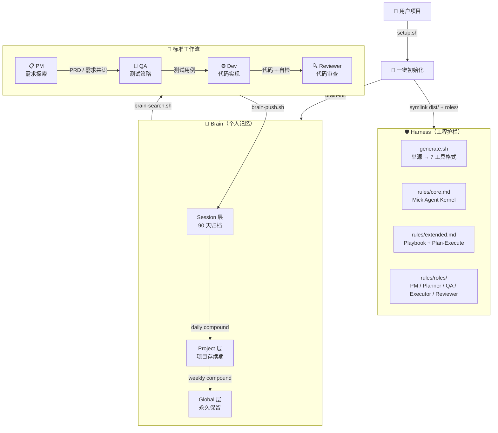

# Mick Harness Rules

一套可被 N 个项目复用的 Vibe Coding 脚手架，引入即生效。不侵入项目代码，不污染项目仓库。像 `.env` 一样存在。

它围绕两个核心能力展开：

- **Harness（工程护栏）**
  - **Mick Agent Kernel**：`rules/core.md` 固化 Mick 的判断方式、证据纪律、完成定义、撞墙熔断和交接方式
  - **Playbook 分层**：`rules/extended.md` 放高风险场景的执行手册；普通代码风格优先交给项目工具链
  - **Anti-Wall 调试控制器**：同一错误重复出现时，强制证据复核、整体 review、完成验证，避免反复撞墙
  - **Cross-System Preflight**：涉及版本、权限、远程服务、配置格式、OS/CLI/API 时，先核对边界再实现
  - **Interaction QA Contract**：涉及 UI/菜单/开关/状态显示时，强制验证真实状态源和用户路径
  - **Harness Self-Test**：让 Agent 用当前任务回答 5 个理解校验点，证明不是只"读过规则"
  - **多格式生成**：`generate.sh` 自动产出 `AGENTS.md` / `CLAUDE.md` / `.cursorrules` / `.windsurfrules` / `.clinerules` / `copilot-instructions.md` / `.trae/rules.md`
  - 多 Agent 角色协作（PM / Designer / QA / Reviewer / Dev）
  - 强制需求审查门禁
  - Git 工作流 + CI/CD 护栏
- **Brain（个人记忆）**
  - 三层记忆模型（Global / Project / Session）
  - 自动蒸馏 + 检索优先
  - 自动写入随生成器流入各 IDE 规则文件

### 为什么是单源 + 个人 Agent 约束

Harness 的第一目标不是"强弱模型切换"，而是让任何 Coding Agent 进入项目后都先变成 **Mick 的个人 Agent**：按你的证据标准、调试纪律、完成定义和协作方式工作。上下文预算优化只是实现这个目标的分发策略。

旧版核心规范只活在一份 Cursor 专有的 `.cursorrules` 里，长达上百行——不同工具和不同模型读到的上下文不一致，对推理较弱的模型（GLM / Qwen / DeepSeek / Trae 等）指令遵循率会断崖下跌，排在后面的规则几乎不执行。

新版把规则拆成两层：

| 层 | 文件 | 谁读 | 形态 |
|----|------|------|------|
| **core** | `rules/core.md` | 所有工具 | Mick Agent Kernel：证据优先、边界控制、撞墙熔断、完成验证、反馈处理、交接卡片 |
| **extended** | `rules/extended.md` | 按需读取 | Playbook：Code Quality、Anti-Wall、Preflight、Interaction QA、Git、CI-CD、测试、角色协作、Brain 写入 |

`generate.sh` 用两套 profile 分发：**lean**（AGENTS / Claude / Copilot / Trae —— core + Self-Test 内联，extended 指针，省 context）和 **full**（Cursor / Windsurf / Cline —— 全量内联）。改一处 `core.md`，跑一次 `generate.sh`，所有工具同步更新。

## 这个项目解决什么问题

用 AI 写代码的时候，普遍会遇到三个问题：

1. **没有个人判断层** — AI 会写代码，但不会天然按 Mick 的证据标准、产品边界、完成定义和反驳方式工作
2. **没有记忆** — 每次对话都是从零开始，之前踩过的坑、做过的决策全部丢失
3. **没有闭环纪律** — 复杂功能能很快落地，但交互细节、外部系统、重复 Bug 容易反复撞墙

这个脚手架的设计是：

- **Harness 解决 1 和 3** — 通过 Kernel + Playbook + Agent 角色模板，让 AI 先按 Mick 的工作纪律运行，再进入具体工程实现
- **Brain 解决 2** — 通过三层记忆模型，让经验跨对话、跨项目持久化

## 快速开始

### 全局 CLI（推荐 — 一次安装，任何项目一句话初始化）

```bash
# 第一步：全局安装（只需做一次）
git clone https://github.com/MickMi/mick_harness_rules.git ~/.mick-harness
ln -s ~/.mick-harness/bin/harness ~/.local/bin/harness

# 第二步：进入任意项目，一句话初始化
cd /path/to/your/project
harness init
```

之后：
- 任何项目里 `harness init` 一键挂载
- `harness update` 更新 Harness 版本 + 刷新所有注册项目
- `harness check` 验证当前项目脚手架完整性

`harness init` 会自动生成 `.harness-config.yaml`，AI 在工作时会读它决定行为。你可以直接编辑这个文件调整工作流偏好：

1. **Brain（个人记忆）**：是否启用跨对话记忆
2. **Design（设计工作方式）**：html / ai_tool_spec / designer_brief / skip
3. **Dev（开发栈范围）**：全栈 / 纯后端 / 纯前端 / 客户端 / CLI
4. **Testing（测试投入）**：严格 TDD / 关键路径 / 仅冒烟 / 不写测试
5. **Strictness（流程严格度）**：强门禁 / 软提示 / 自由

### 传统方式（项目内 Clone）

```bash
git clone https://github.com/MickMi/mick_harness_rules.git .harness && .harness/setup.sh
```

### Harness Self-Test

当你切到任意 Agent 或怀疑它没有真正读懂规则时，直接发：

```text
请按 Harness Self-Test 用 5 句话证明你理解当前任务约束。
```

合格回答必须绑定当前任务，说清楚当前模式、最高风险、如何证明完成、撞墙时如何停、以及这轮不会做什么。泛泛复述规则视为未通过。

### Harness Self-Test

当你切到任意 Agent 或怀疑它没有真正读懂规则时，直接发：

```text
请按 Harness Self-Test 用 5 句话证明你理解当前任务约束。
```

合格回答必须绑定当前任务，说清楚当前模式、最高风险、如何证明完成、撞墙时如何停、以及这轮不会做什么。泛泛复述规则视为未通过。

后续运行非交互式 / CI 用：

```bash
.harness/setup.sh --non-interactive          # 全部用默认值
.harness/setup.sh --profile profiles/web.yaml # 用预设 profile
.harness/setup.sh --reconfigure              # 项目演化时重新问一遍
```

> **Fork 用户**：首次运行会自动检测 fork 并重置 brain 数据。也可以显式传入 `--fresh`：
> ```bash
> .harness/setup.sh --fresh
> ```

> **只要 Brain 不要 Vibe 脚手架**：如果项目已有自己的 MEMORY.md / TODO.md / docs/，可以跳过：
> ```bash
> .harness/setup.sh --no-vibe
> ```

### 更新 Harness 版本

```bash
cd .harness && git pull
```

### 传统方式（全局仓库 + symlink）

如果你更喜欢把 harness 放在全局位置，通过 symlink 挂载到多个项目：

```bash
# Clone 到全局位置
git clone https://github.com/MickMi/mick_harness_rules.git ~/mick_harness_rules
chmod +x ~/mick_harness_rules/*.sh

# 初始化到目标项目
~/mick_harness_rules/vibe-init.sh /path/to/your/project

# 新用户加 --fresh
~/mick_harness_rules/vibe-init.sh --fresh /path/to/your/project
```

### 自动检测机制

`brain-init.sh` 使用三层检测确保新用户拿到干净的 brain：

| 检测维度 | 触发条件 | 行为 |
|----------|----------|------|
| **`--fresh` 参数** | 用户显式传入 | 无条件清空 brain，记录新 owner |
| **Git remote owner** | `.brain-owner` 中的 owner 与当前 Git remote 不一致 | 自动清空 brain |
| **系统用户名** | `.brain-owner` 中的 system_user 与当前 `whoami` 不一致 | 交互式询问是否清空 |
| **首次运行 + 非空 brain** | 无 `.brain-owner` 但 brain 中有数据 | 交互式询问是否清空 |

整个过程零手动操作（或最多一次 Y/n 确认）。新用户拿到的是完整的 Harness 规范 + 干净的 Brain，可以立即开始积累自己的记忆。


## 一图看懂


```mermaid
flowchart TD
    subgraph Harness["🛡️ Harness（工程护栏）"]
        GEN["generate.sh<br/>单源 → 7 工具格式"]
        CORE["rules/core.md<br/>Mick Agent Kernel"]
        EXT["rules/extended.md<br/>Playbook + Plan-Execute"]
        ROLES["rules/roles/<br/>PM / Planner / QA / Executor / Reviewer"]
    end

    subgraph Flow["🔄 标准工作流"]
        PM["📋 PM<br/>需求探索"]
        QA["🧪 QA<br/>测试策略"]
        DEV["⚙️ Dev<br/>代码实现"]
        RV["🔍 Reviewer<br/>代码审查"]
        PM -->|"PRD / 需求共识"| QA
        QA -->|"测试用例"| DEV
        DEV -->|"代码 + 自检"| RV
    end

    subgraph Brain["🧠 Brain（个人记忆）"]
        S["Session 层<br/>90 天归档"]
        P["Project 层<br/>项目存续期"]
        G["Global 层<br/>永久保留"]
        S -->|"daily compound"| P
        P -->|"weekly compound"| G
    end

    User["👤 用户项目"] -->|"setup.sh"| Init["🚀 一键初始化"]
    Init -->|"symlink dist/ + roles/"| Harness
    Init -->|"brain-init"| Brain
    Flow -->|"brain-push.sh"| S
    Brain -->|"brain-search.sh"| Flow
```

## 核心架构

这个项目采用**双仓库模型**（ADR-016）：

| 仓库 | 可见性 | 回答的问题 | 对应内容 |
|------|--------|-----------|----------|
| **Harness**（`mick_harness_rules`） | 公开 | "怎么做" | `.cursorrules`、`.prompts/`、`docs/`、脚本工具 |
| **Brain**（`mick_brain`） | 私有 | "知道什么" | `global/`、`projects/`、`sessions/`、`MEMORY.md` |

挂载方式：

- Brain 仓库 clone 到 `~/.mick-brain/`，harness 中的 `brain/` 通过 symlink 指向它
- 通过 symlink（`.harness/`、`.cursorrules`、`.prompts/`）引入到目标项目，不复制文件
- `.gitignore` 自动隔离，所有脚手架内容不会出现在项目的 Git 历史中
- 独立于任何业务项目的发布节奏

```
mick_harness_rules/ (公开)         ~/.mick-brain/ (私有)
├── .cursorrules                   ├── global/preferences.md
├── .prompts/                      ├── global/gotchas.md
├── brain-init.sh                  ├── projects/<slug>/learnings.md
├── brain-push.sh                  ├── sessions/YYYY-MM-DD/
├── brain-resolve.sh               ├── MEMORY.md
├── brain/ → symlink               ├── .brain-owner
└── ...                            └── .gitkeep
```
## 三层记忆

### Session 层

- 位置：`brain/sessions/YYYY-MM-DD/`
- 保留：90 天后自动归档
- 内容：每次 AI 对话中产生的 gotcha、decision、preference、env 记录
- 写入：AI 自动触发或 `brain-push.sh` 手动写入

### Project 层

- 位置：`brain/projects/<slug>/`
- 保留：项目存续期
- 内容：项目专属的技术选型、架构决策、踩坑记录
- 来源：从 Session 层蒸馏（daily compound）

### Global 层

- 位置：`brain/global/`
- 保留：永久
- 内容：跨项目通用的编码偏好、工具链选择、通用踩坑记录
- 来源：从 Project 层蒸馏（weekly compound）

### 蒸馏

```
Session（原始素材）
    ↓ daily compound（≥5 条未蒸馏条目触发）
Project（项目级精华）
    ↓ weekly compound（本周 ≥3 条新增触发）
Global（跨项目通用经验）
```

由 `brain-compound.sh` 执行。支持智能触发、相似检测、合并策略、分类路由和 `--dry-run` 预览。

### 检索

不全量读取记忆文件。推荐顺序：

1. `brain-search.sh <keyword>` — ripgrep 精准搜索
2. 定向读取特定文件片段
3. 只有前面都不够时，才读完整文件

## Agent 角色

内置 5 个 Agent 角色（源文件在 `rules/roles/`，项目里映射为 `.prompts/`）。调度由 **优先级链**（plan.md > STATE.md > 用户意图）决定，详见 `rules/roles/orchestration.md` 顶部。

| 角色 | 文件 | 职责 | 唤起 |
|------|------|------|------|
| **PM Agent** | `rules/roles/pm.md` | 需求探索、对抗性审查、目标发现。**管"做什么"** | "用 PM 角色聊需求" |
| **Planner Agent** | `rules/roles/planner.md` | 需求共识 → 可执行 plan.md。**管"怎么落地"** | "用 Planner 角色写 plan" |
| **QA Agent** | `rules/roles/qa.md` | 测试策略、用例矩阵、质量门禁 | "用 QA 角色制定测试" |
| **Reviewer Agent** | `rules/roles/reviewer.md` | 代码审查、逻辑完备性、安全审计 | "用 Reviewer 角色审查" |
| **Dev Agent** | `rules/extended.md` | 编码实现、调试、架构设计（默认角色） | 默认 |
| **Designer Agent** | `rules/roles/designer.md` | **可选外部角色** — 校验外部 Design AI 的视觉稿 | 显式点名时激活 |

### 需求探讨与分支

实质性需求（新功能、重构、架构变更）必须先完成需求探讨和对抗性审查。这个阶段的目标是形成需求共识，而不是默认产出 PRD。

1. 用户先描述 demo、场景、问题或方向
2. AI 沿着目标、边界、数据、AI 风险、用户路径等关键不确定性追问和审查
3. 需求共识形成后，用户明确选择分支：
   - 给人类/同事沟通 → 输出 PRD
   - 让 Executor 实现 → 输出 plan.md（Planner 角色）

需求共识未锁定、分支未明确前，禁止 Agent 擅自进入实现。

豁免：单文件 Bug 修复、文档更新、格式化、用户明确说"跳过审查"。

## 仓库内容

```
mick_harness_rules/
├── rules/                    # ⭐ 单一数据源
│   ├── core.md               #   Mick Agent Kernel（所有工具都读）
│   ├── extended.md           #   Playbook + Anti-Wall + Preflight + Interaction QA + Plan-Execute
│   └── roles/                #   Agent 角色模板（项目里映射为 .prompts/）
│       ├── orchestration.md  #     角色编排协议
│       ├── pm.md             #     PM 角色（需求审查官）
│       ├── designer.md       #     Designer 角色
│       ├── qa.md             #     QA 角色
│       └── reviewer.md       #     Reviewer 角色
├── generate.sh               # ⭐ 单源 → 多格式生成器（--check 校验同步）
├── dist/                     # 生成产物（gitignore，每次 mount 前重建）
│   ├── AGENTS.md  CLAUDE.md  .cursorrules  .windsurfrules  .clinerules
│   ├── .github/copilot-instructions.md
│   └── .trae/rules.md
├── lib-mount-rules.sh        # 共享挂载库（setup.sh / brain-init.sh 共用，防漂移）
├── .brain-config.yaml        # Brain 配置（仓库地址、保留策略、搜索引擎）
├── .gitignore                # 忽略 brain 个人数据 + dist/
├── brain/                    # → symlink 到 ~/.mick-brain/（私有 brain 仓库）
├── setup.sh                  # ⭐ 一键初始化（含交互式问答 + --reconfigure）
├── brain-init.sh             # 挂载 harness + brain（全局仓库 symlink 模式）
├── brain-resolve.sh          # 共享库：解析 brain 数据路径（双仓库/单仓库自动适配）
├── brain-migrate.sh          # 一次性迁移脚本（单仓库 → 双仓库）
├── brain-check.sh            # 验证脚手架完整性（13 项检查，含单源同步）
├── brain-push.sh             # 向 brain 写入记忆（CLI / 剪贴板 / 交互模式）
├── brain-search.sh           # 基于 ripgrep 的记忆检索
├── brain-compound.sh         # 智能蒸馏（Session → Project → Global）
├── brain-gc.sh               # 容量治理（归档 + 清理）
├── vibe-init.sh              # Vibe Coding 脚手架初始化（自动链式调用 brain-init）
├── docs/
│   ├── architecture.md       # Harness 自身的系统架构文档
│   ├── architecture-template.md  # 新项目架构模板（init 时复制到目标项目）
│   └── ci_cd_templates.md    # CI/CD 模板库
├── MEMORY.md                 # 框架级架构决策记录（ADR）
└── TODO.md                   # 任务清单与状态流转
```


## 日常使用

```bash
# 搜索记忆
.harness/brain-search.sh "ripgrep"

# 写入记忆
.harness/brain-push.sh --layer session --source cursor "gotcha: xxx"

# 运行蒸馏
.harness/brain-compound.sh --mode auto

# 容量治理
.harness/brain-gc.sh --report

# 验证完整性
.harness/brain-check.sh
```

## 多 IDE 支持

所有规则文件都由 `generate.sh` 从单一数据源产出，再由 `setup.sh` / `brain-init.sh` 以 symlink 挂载到项目（`.gitignore` 隔离，只忽略 harness 真正接管的文件）：

| 工具 | 规则文件 | profile | 内容 |
|-----|---------|---------|------|
| Codex / Zed / Aider | `AGENTS.md` | lean | core 内联 + extended 指针 |
| Claude Code | `CLAUDE.md` | lean | core 内联 + extended 指针 |
| Cursor | `.cursorrules` | full | core + extended 全量 |
| Windsurf | `.windsurfrules` | full | core + extended 全量 |
| Cline / Roo | `.clinerules` | full | core + extended 全量 |
| VS Code Copilot | `.github/copilot-instructions.md` | lean | core 内联 + extended 指针 |
| Trae | `.trae/rules.md` | lean | core 内联 + extended 指针 |
| Agent 角色 | `.prompts/` → `rules/roles/` | — | 显式点名调用 |

> 改规则只需编辑 `rules/core.md` 或 `rules/extended.md`，再跑 `.harness/generate.sh`，全部工具同步更新。

### Mick Agent Capsule（个人智能体）

> There are many agent harnesses, but this one is mine.

Harness 的核心不是"多一套编码规范"，而是把任意 Coding Agent 临时变成 **Mick 的个人 Agent**。如果 Brain 仓库中存在个人上下文，`generate.sh` 会生成一段 **Mick Agent Capsule** 并注入所有 7 种工具规则文件头部。

Capsule 的输入源（存在即纳入）：

- `~/.mick-brain/global/agent-capsule.md` — 手写/蒸馏后的最终短胶囊，优先级最高
- `~/.mick-brain/constitution.md` — 第一性原理、对抗式审查、反馈分级等个人铁律
- `~/.mick-brain/global/persona.md` — 用户是谁、怎么判断问题
- `~/.mick-brain/global/preferences.md` — 代码/PRD/沟通偏好
- `~/.mick-brain/global/collaboration-style.md` — 技术 PM 协作协议
- `~/.mick-brain/global/gotchas.md` — 可检索的踩坑源（默认不展开原文，避免私人上下文泄漏）

- **有 Brain / Capsule** → 所有工具拿到统一的个人行为约束
- **没有 Brain**（别人的机器）→ 静默跳过，纯工程规则

Brain 变更后，Brain 的 `post-commit` / `post-merge` hook 会自动对所有注册项目触发 `generate.sh` + 规则重新挂载。整个链路：

```
编辑 ~/.mick-brain/constitution.md / global/*.md → git commit
  → post-commit hook 触发
    → 遍历 ~/.mick-brain/.harness-projects（所有注册项目）
      → 每个项目 .harness/generate.sh
        → 7 种工具规则文件全部刷新，Mick Agent Capsule 同步到位
```

> Agent Capsule 的源文件在私有 Brain 仓库中，不会出现在公开的 harness 仓库里。公开仓库只保留生成与注入机制。

AI 会在以下事件发生时自动写入记忆（支持 shell 的环境）：

- 🐛 **Gotcha** — 非显而易见的 Bug、API 怪癖、库限制
- 🏗️ **Decision** — 选择了某个库/方案，做了取舍
- 💡 **Preference** — 用户表达了编码风格、命名约定偏好
- ⚠️ **Environment** — OS 特定行为、CI/CD 约束、版本兼容问题

## 容量治理

`brain-gc.sh` 防止记忆无限膨胀：

- Session 超过 90 天自动归档到 `.archive/sessions/`
- MEMORY.md 超过 500 行自动归档旧条目到 `MEMORY.archive.md`
- `--report` 输出各层文件数、大小、过期状态

## 适合什么场景

- 一套可复用的个人 Agent Kernel，引入任何项目即按 Mick 的工作纪律运行
- 跨对话、跨项目的持久化记忆
- 多 Agent 角色协作，先形成需求共识，再明确分支到 PRD 或 plan.md
- 本地优先、文件优先、不依赖云服务

它是一个 **file-first**、**local-first** 的个人基础设施。

## 设计原则

| 原则 | 说明 |
|------|------|
| `.env` 模式 | symlink 挂载，`.gitignore` 隔离，**零泄漏**——目标项目 Git 中不含任何脚手架内容 |
| 双仓库隔离 | Harness（公开）+ Brain（私有），fork 时天然不带个人记忆 |
| 验证闭环 | 加载 → 检查 → 拦截 → 报告 |
| 检索优先 | 禁止全量读取，优先 ripgrep |
| 优雅降级 | 有高级工具用高级工具，没有就回退；无 brain 仓库时 fallback 到本地目录 |
| 幂等挂载 | 重复运行不出错 |
| 需求先行 | 实质性需求必须经过多轮审查 |
| Fork 即用 | fork 用户首次 init 自动检测并重置 brain，零手动操作 |

---

## 附录 A：Brain 双仓库模型详解

### 为什么需要双仓库？

Brain 存储的是个人记忆（编码偏好、踩坑记录、项目经验），这些数据：
- **需要多机同步**：你可能在 MacBook、台式机、公司电脑上工作
- **不应公开**：fork 你的 harness 仓库的人不应该看到你的个人记忆

单仓库模型无法同时满足这两个需求。双仓库模型将 Harness（公开工具）和 Brain（私有记忆）分离，各自通过 Git 同步。

### Brain 仓库结构

```
mick_brain/ (私有仓库)
├── global/
│   ├── preferences.md    # 跨项目编码偏好
│   └── gotchas.md        # 跨项目踩坑记录
├── projects/
│   └── <slug>/
│       └── learnings.md  # 项目专属经验
├── sessions/
│   └── YYYY-MM-DD/
│       └── <source>.md   # 原始对话摘要
├── MEMORY.md             # 个人记忆与 ADR
├── .brain-owner          # 所有权标记
└── .gitkeep
```

### 连接机制

`brain-init.sh` 在 Phase 0.5 自动完成：

1. 读取 `.brain-config.yaml` 中的 `brain_repo.remote` 和 `brain_repo.local_path`
2. 如果 `~/.mick-brain/` 不存在，自动 `git clone`
3. 在 harness 仓库中创建 symlink：`brain/` → `~/.mick-brain/`
4. 所有 brain-*.sh 脚本通过 `brain-resolve.sh` 自动解析正确的路径

### 多机同步流程

```
机器 A                              机器 B
├── ~/project-x/                    ├── ~/project-y/
│   └── .harness/ → harness repo    │   └── .harness/ → harness repo
├── ~/mick_harness_rules/           ├── ~/mick_harness_rules/
│   └── brain/ → ~/.mick-brain/     │   └── brain/ → ~/.mick-brain/
└── ~/.mick-brain/ (git sync)       └── ~/.mick-brain/ (git sync)
         ↕                                    ↕
    github.com/MickMi/mick_brain (private)
```

每次 `brain-push.sh` 写入记忆后，自动 commit + push 到 brain 仓库。
在另一台机器上运行 `brain-init.sh` 时，自动 pull 最新数据。

### 向后兼容

如果 `.brain-config.yaml` 中没有配置 `brain_repo.remote`，所有脚本自动 fallback 到本地 `brain/` 目录（单仓库模式）。这意味着：
- Fork 用户不需要创建自己的 brain 仓库也能正常使用
- 只是记忆不会跨机器同步

### 新机器初始化步骤

在一台新机器上从零开始：

```bash
# 进入你的项目目录
cd /path/to/your/project

# 一行命令完成所有初始化
git clone https://github.com/MickMi/mick_harness_rules.git .harness && .harness/setup.sh

# setup.sh 会自动：
#   - 创建 .cursorrules / .prompts/ symlink
#   - 配置 .gitignore 隔离
#   - 部署 Vibe 脚手架文件（已有则跳过）
#   - 读取 .brain-config.yaml 中的 brain_repo 配置
#   - Clone brain 仓库到 ~/.mick-brain/
#   - Pull 最新记忆数据
#   - 运行完整性检查
```

你不需要手动 clone brain 仓库或执行任何额外操作。

#### 传统方式（全局仓库）

如果你更喜欢全局仓库 + symlink 模式：

```bash
git clone https://github.com/MickMi/mick_harness_rules.git ~/mick_harness_rules
chmod +x ~/mick_harness_rules/*.sh
~/mick_harness_rules/brain-init.sh /path/to/your/project
```
