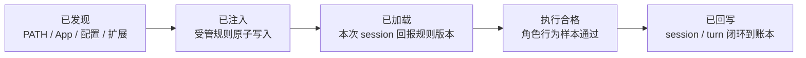
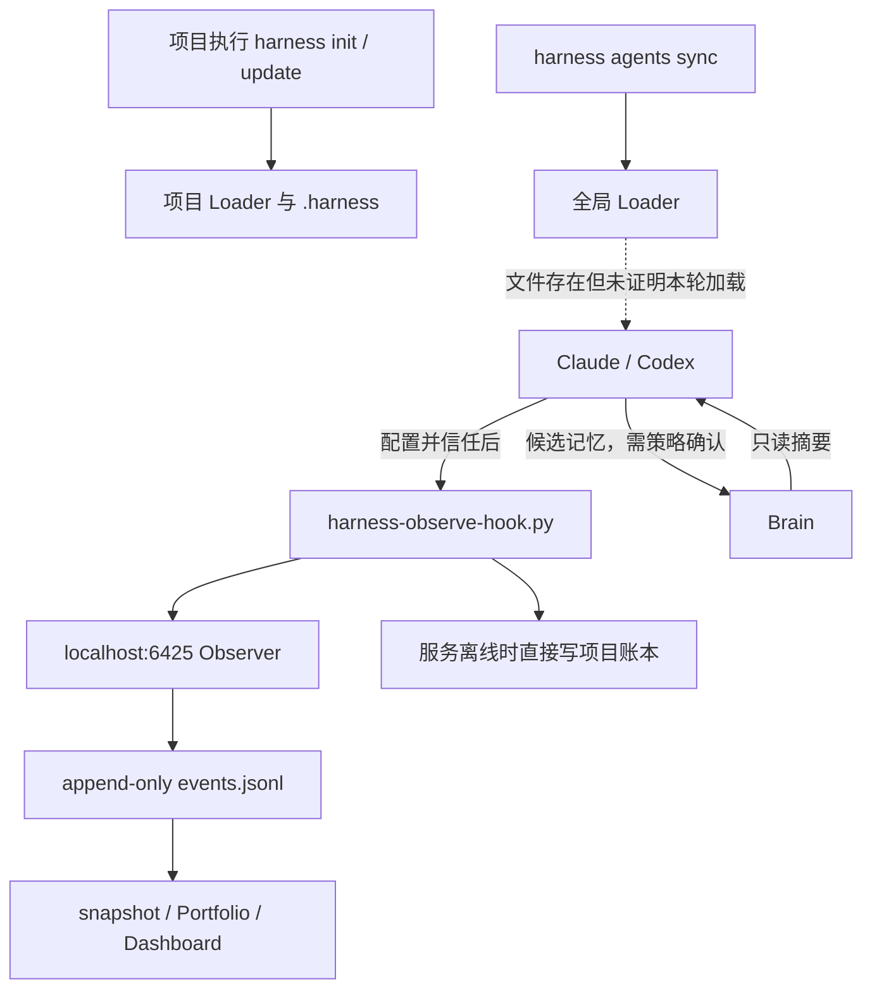

# Code Agent 支持与可靠性基线

> 适用版本：v0.17.0
> 基线日期：2026-08-13
> 本文是能力事实与验收边界，不以界面文案代替运行证据。

## 五层状态模型



每层只能由该层自己的证据点亮：

| 层级 | 必要证据 | 不能作为证据 |
|---|---|---|
| 已发现 | 注册表中的检测信号至少命中一项 | 产品名称出现在文档中 |
| 已注入 | 目标文件只有一份完整受管区块，digest 与当前规则一致 | 文件存在 |
| 已加载 | 当前 session 的 Hook 事件携带当前规则版本与角色版本 | Loader 已写入 |
| 执行合格 | 角色行为样本满足职责、交付、验证和边界评分 | 角色文档存在 |
| 已回写 | 同一 session 的 start/end 与 turn 往返可在账本定位 | Observer 服务健康 |

## v0.17.0 支持边界

| Agent | 等级 | 发现 | 注入 | 加载证明 | 生命周期回写 | 说明 |
|---|---|---:|---:|---:|---:|---|
| Claude Code | Tier 1 | 是 | 是 | 是 | 部分验证 | 已有真实 session start/end；用户退出账号后不再补做 turn 与行为评测 |
| Codex | Tier 1 | 是 | 是 | 是 | 是 | Codex CLI Hook 已信任；真实 session/turn 四状态闭环已入账 |
| Cursor | Tier 2 | 尽力 | 仅能力说明 | 否 | 否 | 不伪造完整支持 |
| Windsurf | Tier 2 | 尽力 | 仅能力说明 | 否 | 否 | 不伪造完整支持 |
| Cline | Tier 2 | 尽力 | 仅能力说明 | 否 | 否 | 不伪造完整支持 |
| Roo Code | Tier 2 | 尽力 | 仅能力说明 | 否 | 否 | 不伪造完整支持 |
| Trae | Tier 2 | 尽力 | 仅能力说明 | 否 | 否 | 不伪造完整支持 |

“自动发现所有 Code Agent”不是本版本承诺。系统只对注册表中的已知 Agent 检查 PATH、macOS App、配置目录和编辑器扩展四类可重现信号。

## 当前链路基线



2026-08-13 发布候选实测事实：

- Claude Code 与 Codex 均被 `agents doctor` 发现，两者全局 Loader 各有一份带 v0.17.0 版本的 `MICK-HARNESS-GLOBAL` 区块，legacy 区块为 0。
- `~/.claude/settings.json` 与 `~/.codex/hooks.json` 均配置 SessionStart、UserPromptSubmit、Stop、SessionEnd 四个 Observer Hook；重复同步为 no-op。
- Claude Code 已产生带当前规则版本的真实 session start/end 证据；用户于 2026-08-13 退出账号，因此未补做完整 turn 闭环与角色行为评分，工作台必须保持“执行未验证”。
- Codex CLI 的四类命令 Hook 已在 `/hooks` 审查并信任；同一真实 session 已形成 SessionStart → TurnStart → TurnCompleted → SessionEnd 闭环，且 Reviewer 行为样本评分为 10/10。
- 全量 71 项测试通过；真实工作台 Agent API 能区分“配置存在”和“真实加载/回写”，不会把二者合并成成功。

## 威胁模型与数据边界

| 风险 | 保护措施 | 验收探针 |
|---|---|---|
| 覆盖用户自有配置 | 只替换明确 marker；原子写入；变更前备份 | 注入中断后旧文件字节不变 |
| 重复注入或 legacy 冲突 | doctor 报告区块计数；migrate 幂等清理 | 连续两次结果字节一致 |
| “已写入”误报为“已加载” | 加载证明必须来自当前 session Hook | 删除 Hook 后状态降级 |
| 服务离线丢事件 | 本地持久化队列与幂等重放 | 停服务投递、重启重放无丢失 |
| 重复投递制造重复记录 | 稳定 idempotency key 与账本去重 | 同一事件投递两次只记一条 |
| Prompt、回复、transcript 泄漏 | Hook 白名单取值，schema 拒绝正文键 | 注入诱饵后账本/API 搜索不到原文 |
| Brain 私人正文进入项目 | 只传摘要、来源 digest 和分类；写入先形成候选 | 隐私诱饵不出现在项目与事件中 |
| 第三方 Skill 覆盖 Harness | 外部 Skill 仅补能力，不拥有调度/权限/完成定义 | 来源审计与角色契约测试 |

## v0.19 外部 Skill 四态模型

工作台“设置 → 能力与 Skill”把外部能力拆成四个独立事实，避免把一个目录的存在误报为 Agent 能力已经生效：

| 状态 | 含义 | 必要证据 |
|---|---|---|
| 已发现 | 只读扫描在支持目录中找到 `SKILL.md` | 受限目录、合法路径和可读文件 |
| 已安装 | Skill 文件已经存在于 Harness、本机 Agent/插件或项目目录 | 本机文件事实；不代表安全或会被加载 |
| 已分配 | Harness 明确把 Skill 作为某个角色的方法附件 | Harness 内置映射或未来经用户确认的分配记录 |
| 已验证加载 | 真实 Agent 任务回报了可定位的 Skill 标识与版本 | 运行时事件；静态扫描、文件存在和角色分配都不够 |

当前扫描目录为 Harness `rules/skills/`、`~/.codex/skills/`、`~/.claude/skills/`、`~/.agents/skills/`、Codex 插件缓存中的 Skills，以及已登记项目的 `.harness/skills/`。扫描器不接受前台提供的任意路径，不读取凭据，不返回 Skill 正文，不运行 `scripts/`，也不联网安装。

v0.21 的四个 Harness 命令 Skill 是受管例外：`harness agents sync` 会为 Codex 的 `~/.codex/skills/` 与 Claude Code 的 `~/.claude/skills/` 建立指向当前 Harness 安装的链接。只管理 `harness-plan`、`harness-goal`、`harness-brain`、`harness-e2e`；若用户已经有同名文件或目录则报告冲突并保留原内容。链接存在仍只代表“已安装”，必须在新会话显式调用并回写运行证据后才能显示“已验证加载”。

兼容诊断分为三类：普通能力且未触碰 Harness 所有权边界时显示“可兼容”；包含脚本、联网安装、Hook、角色路由、完成定义、Brain 写入或后台服务时显示“需要审查”；包含破坏命令或覆盖全局 Loader 时显示“禁止接入”。静态结论只用于接入前 Gate，不替代许可证、固定版本、人工审计和真实任务验证。

## 失效用例基线

1. Agent 只有配置目录、命令不在 PATH：应显示发现信号来源，不误报可执行。
2. Loader 有未闭合 marker：doctor 报冲突，sync 不写入。
3. 同时存在 global 与 legacy 区块：doctor 报迁移项，migrate 只删除 legacy 受管区块。
4. 写入在替换前中断：目标仍是旧文件，临时文件可清理。
5. Hook 脚本存在但 Agent 配置无引用：只显示“已注入”，不能显示“已加载”。
6. Hook 收到超大、无效或含敏感正文的 JSON：静默放行 Agent，且不持久化正文。
7. Observer 离线：事件进入项目级队列；服务恢复后按幂等键重放。
8. 账本锁由已退出进程遗留：在可证明过期后恢复，不删除活锁。
9. Brain 搜索命中私人正文：只把经脱敏的摘要和 digest 暴露给项目。
10. Tier 2 Agent 被发现：明确显示能力缺口，不显示 Tier 1 的加载与回写状态。

## 发布验收口径

v0.17.0 的“完成”要求隔离配置迁移、故障注入、隐私测试、真实全局配置和至少一个 Tier 1 Agent 的完整 session/turn 与行为样本通过。Codex 已满足该 Gate。Claude Code 因用户退出账号而作为明确发布例外保留“部分生命周期、执行未验证”，不能显示“执行合格”。

## 从旧版本迁移

迁移分成诊断、预览、应用和新会话验证，不能用一次覆盖操作代替：

```bash
harness agents doctor
harness agents migrate --dry-run
harness agents hooks --dry-run
```

确认目标只有 `~/.claude/CLAUDE.md`、`~/.codex/AGENTS.md`、`~/.claude/settings.json` 和 `~/.codex/hooks.json` 后，再显式应用：

```bash
harness agents migrate
harness agents hooks
harness agents doctor
```

- Loader 与 Hook 写入均保留同目录 `.mick-harness.bak`，并只修改 Harness 自己的受管区块或 Hook 项。
- 已注入项目无需复制新规则；运行 `harness update` 刷新全局版本并同步已登记项目。
- 旧事件仍可读取。v0.17+ 提交继续使用向后兼容的 ingest envelope `0.2.0`；v0.20 工作回合新增可选的 `review_mode`、`gate_result`、`workflow_exception` 和证据引用。离线事件先进入项目 `.harness-runtime/outbox/`，确认写入后自动清除。
- 最后必须重开 Claude Code / Codex 会话。只有新 session 的事件带有当前 `rule_version`，工作台才显示“加载已验证”；Hook 已配置但没有新会话时显示“待真实会话”。
- Codex CLI 还需要在自身 `/hooks` 界面信任项目/全局 Hook；Codex Desktop 当前不提供该入口。未信任时不能把文件已写入当作 Hook 已执行。

如 doctor 报 `managed-block-corrupt`、`managed-block-duplicate` 或 `hook-config-invalid`，迁移会拒绝写入。先恢复备份或修复 JSON，再重新 dry-run，禁止用强制覆盖绕过。
