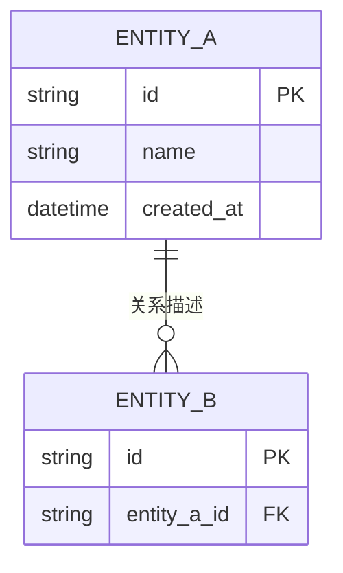
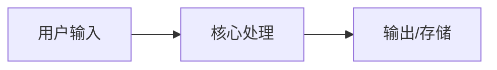

# 系统架构与业务上下文

> **使用说明**：这是项目架构模板。请在初始化后尽快填写「业务最终目标」部分，
> 这是 AI 对齐你的业务意图的核心锚点。其余章节可随项目演进逐步补充。
> 填写完成后删除本说明块。

## 🎯 业务最终目标
<!-- GOAL_PLACEHOLDER -->
(用一两句话描述这个项目的最终形态和核心价值。这是 AI 理解你项目方向的第一锚点。)
<!-- 当 AI 检测到此占位符时，会自动触发 Goal Discovery Protocol，通过 2-3 轮对话帮你明确业务目标。 -->

## 🧩 核心模块划分
| 模块名 | 职责描述 | 对外暴露接口 | 依赖的其他模块 |
|--------|---------|-------------|---------------|
| (模块 A) | (描述职责) | (接口列表) | (依赖列表) |
| (模块 B) | (描述职责) | (接口列表) | (依赖列表) |

## 🗄️ 核心数据模型
(描述核心实体及其关系。建议用简单的 ER 描述或 Mermaid 图。)

## 🔌 API 契约概览
| 端点 | 方法 | 用途 | 请求体摘要 | 响应体摘要 | 鉴权 |
|------|------|------|-----------|-----------|------|
| `/api/v1/xxx` | POST | (用途) | `{ ... }` | `{ ... }` | (Bearer / API Key / 无) |

> 完整 API 文档请参考: (OpenAPI spec 路径或链接，如有)

## 🔀 核心数据流 / 状态管理
(简述数据从输入到输出的流转过程。建议用 Mermaid 流程图。)

## ⚡ 非功能性需求 (NFR)
| 指标 | 目标值 | 备注 |
|------|--------|------|
| **可用性 SLA** | (例如: 99.9%) | |
| **P99 延迟** | (例如: < 200ms) | (关键接口) |
| **QPS 峰值** | (例如: 1000 req/s) | |
| **数据保留策略** | (例如: 日志保留 30 天) | |
| **并发用户数** | (例如: 500) | |

## 🚀 部署拓扑
(描述部署环境和架构。例如：单体/微服务、容器化方式、CDN 策略等。)

- **环境**: (dev / staging / production)
- **容器化**: (Docker / K8s / Serverless)
- **CI/CD**: (GitHub Actions / Jenkins / 其他)
- **CDN/静态资源**: (CloudFront / Vercel Edge / 其他)

## 📐 架构决策记录 (ADR) 索引
| # | 日期 | 决策 | 原因 | 状态 |
|---|------|------|------|------|
| 1 | (日期) | (决策描述) | (原因) | ✅ 生效 |

> 详细决策内容请参考 [MEMORY.md](/MEMORY.md) 中的 ADR 章节。
