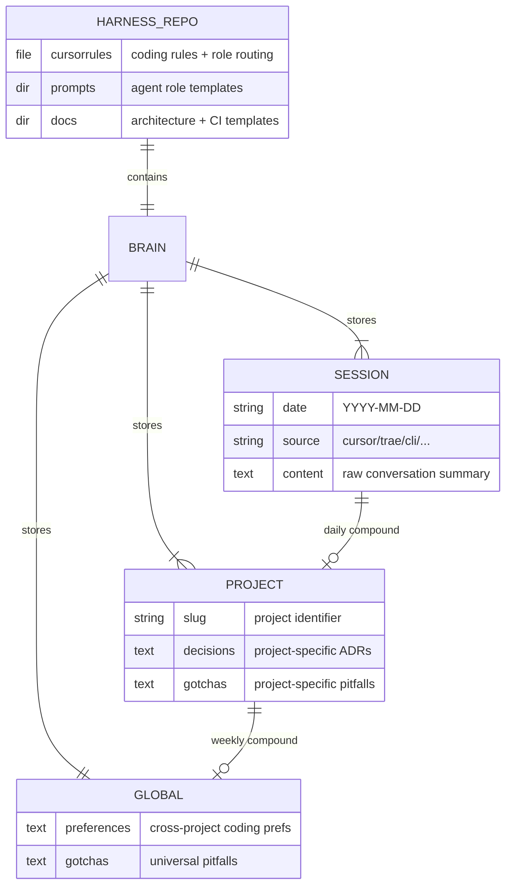
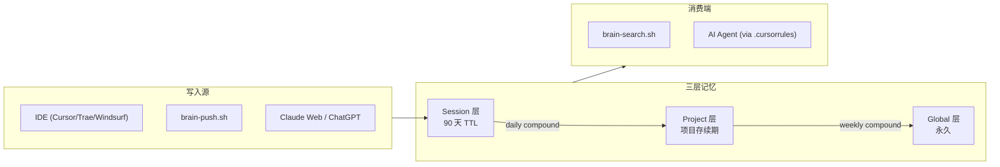

# Mick Harness Rules — 系统架构与业务上下文

## 🎯 业务最终目标
一套跨平台、跨主机、跨 AI 的**个人工程基础设施**，采用**单仓库双职能**模型：
- **Harness Rules**（工程护栏）：规范模板与工程约束 — 定义"怎么做"
- **Git Brain**（`brain/` 子目录）：个人记忆中枢 — 记录"知道什么"

两者合并在同一仓库中，以 `.env` 模式（`.gitignore` 隔离）挂载到任意新项目中，确保 AI 在任何项目中都能遵循你的工程规范并了解你的历史经验。

> **注意**：这是 Harness 仓库自身的架构文档。
> 新项目初始化时使用的是 `docs/architecture-template.md`（空白模板），不会复制本文件。

## 🧩 核心模块划分
| 模块名 | 职责描述 | 对外暴露接口 | 依赖的其他模块 |
|--------|---------|-------------|---------------|
| **Harness Rules** | 编码规范、Agent 角色模板、CI/CD 护栏 | `.cursorrules`、`.prompts/`、`docs/` | — |
| **Git Brain** | 三层记忆存储（Session/Project/Global） | `brain/` 子目录 | Harness Rules（挂载时一起加载） |
| **Init Scripts** | 一键初始化 + 挂载 + 验证 | `vibe-init.sh`、`brain-init.sh`、`brain-check.sh` | Harness Rules、Git Brain |
| **Brain CLI** | 记忆写入、检索、蒸馏、治理 | `brain-push.sh`、`brain-search.sh`、`brain-compound.sh`、`brain-gc.sh` | Git Brain |

## 🗄️ 核心数据模型

## 🔌 API 契约概览
| 端点 | 方法 | 用途 | 请求体摘要 | 响应体摘要 | 鉴权 |
|------|------|------|-----------|-----------|------|
| `/api/v1/xxx` | POST | (用途) | `{ ... }` | `{ ... }` | (Bearer / API Key / 无) |

> 完整 API 文档请参考: (OpenAPI spec 路径或链接，如有)

## 🔀 核心数据流

## ⚡ 非功能性需求 (NFR)
| 指标 | 目标值 | 备注 |
|------|--------|------|
| **可用性 SLA** | (例如: 99.9%) | |
| **P99 延迟** | (例如: < 200ms) | (关键接口) |
| **QPS 峰值** | (例如: 1000 req/s) | |
| **数据保留策略** | (例如: 日志保留 30 天) | |
| **并发用户数** | (例如: 500) | |

## 🚀 部署拓扑

- **环境**: 纯本地（个人开发机），无服务端
- **挂载方式**: symlink（`.harness/` → harness 仓库根目录）
- **版本管理**: Git，独立于业务项目的发布节奏
- **多 IDE 支持**: Cursor / Windsurf / Trae / GitHub Copilot（自动检测 + 注入规则）

## 📐 架构决策记录 (ADR) 索引
| # | 日期 | 决策 | 原因 | 状态 |
|---|------|------|------|------|
| 1 | 2026-03-30 | 确立 Vibe Coding 护栏机制 | 为 AI 辅助编码建立工程规范约束 | ✅ 生效 |
| 2 | 2026-04-09 | 引入三层记忆模型 (Session/Project/Global) | 参考 three-layer-memory-skill，解决记忆扁平化问题 | ✅ 生效 |
| 3 | 2026-04-09 | ~~确立"个人基础设施层"双仓库模型~~ → 已被 ADR-007 取代 | — | ❌ 废弃 |
| 7 | 2026-04-14 | 确立"单仓库双职能"模型 (Harness + Brain 合并)（取代 ADR-002） | 避免双仓库同步复杂度，统一管理 | ✅ 生效 |
| 4 | 2026-04-09 | `brain init` 一键加载 + 验证闭环 | 防止"加载了脚手架但没真正起作用" | ✅ 生效 |
| 5 | 2026-04-09 | 全局记忆只放采控记录 | 项目特有技术选型不放全局，只放跨项目通用偏好 | ✅ 生效 |
| 6 | 2026-04-09 | 检索优先原则 (Search-First) | 避免全量读取浪费 context window | ✅ 生效 |
| 7 | 2026-04-14 | 多平台写入策略 (IDE/CLI/Webhook) | 支持从 Cursor/Trae/Claude Web/ChatGPT 等多源写入 | ✅ 生效 |
| 13 | 2026-04-21 | Fork 自动检测与 Brain 重置 | 支持 fork/clone 开箱即用 | ✅ 生效 |
| 14 | 2026-04-22 | Architecture 模板与实例分离 | 防止 Harness 自身的架构文档污染新项目 | ✅ 生效 |

> 详细决策内容请参考 [MEMORY.md](/MEMORY.md) 中的 ADR 章节。
