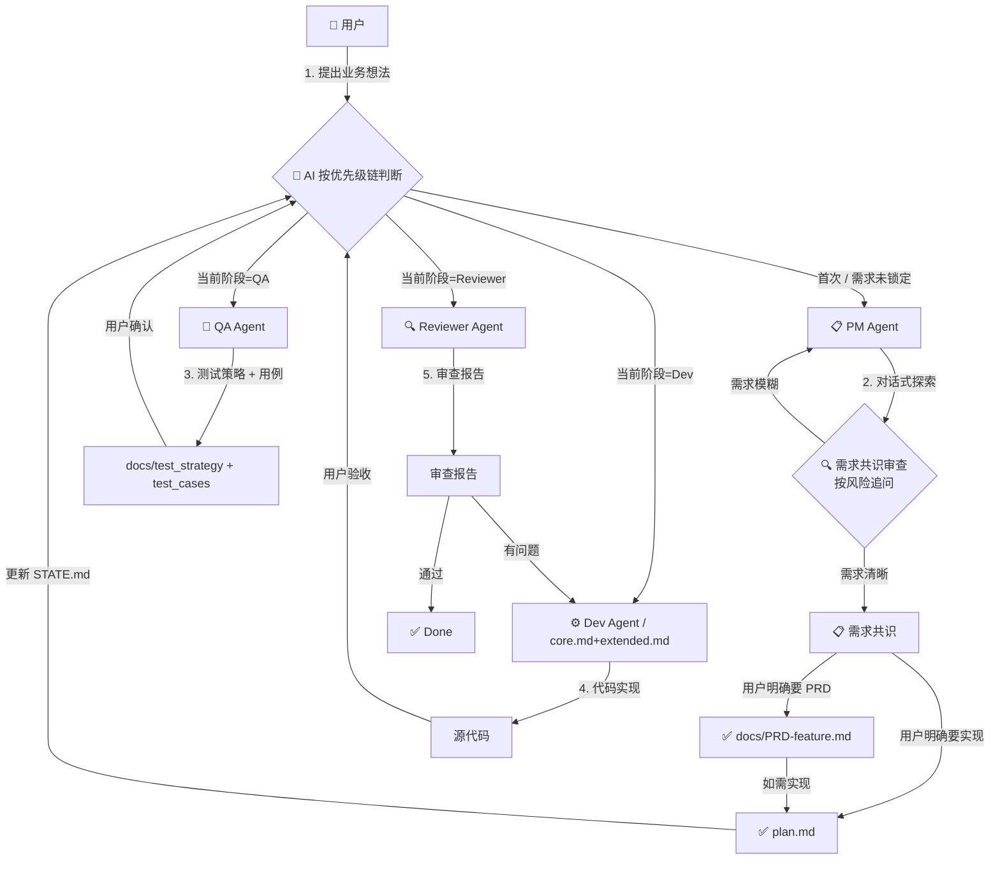

# Agent 编排协议 (Orchestration Protocol)

本文档定义 Agent 角色之间的协作流程、交接规范与数据契约。

> ## 🚦 调度优先级链（单一入口，所有 Agent 必须遵守）
>
> 每次会话开局，Agent 按以下**唯一优先级链**判断自己是谁、该做什么：
>
> ```
> 1. 本轮要改动文件 / 生成交付物，且 plan.md 含 - [ ] 未完成步骤 → Executor 模式
> 2. docs/STATE.md 存在 → 按 STATE.md 当前阶段激活角色
> 3. 用户消息匹配豁免清单 → 直接工作
> 4. 以上都不满足 → 正常响应（纯解释/讨论/头脑风暴不触发流程）
> ```
>
> **链上任何一级命中即停止**，不再往下判断。这是唯一调度入口，所有其他规则（角色路由、状态调度等）服从本条。

> **工具栈适配（v3 新增）**
>
> 项目根目录的 `.harness-config.yaml` 描述本项目的工作流偏好（设计模式、测试投入、流程严格度等）。
> **所有 Agent 在动手前必须先读这个文件**，根据其中的字段调整自身行为。
> 缺失则按各 Agent 模板中的 default 值运行。

> **可观测性（v4 新增）**
>
> 每次工作流回复的**第一行**必须输出脚手架状态行（Scaffold Status Line），让用户一眼判断 AI 有没有走脚手架。纯解释、短问答、头脑风暴不强制输出状态行。
>
> - `[📋 Executor · plan N/M · Step X]` — plan.md 活跃时最高优先（core.md 铁律 0）
> - `[🎭 {角色} · {feature}@{阶段} · {strictness}/{testing}]` — STATE.md 调度
> - `[⚡ 豁免 · {理由}]` — 触发豁免清单
> - `[⚠️ 越阶 · {当前}→{目标}]` — 用户同意跨阶段执行
>
> Status Line 中的每个字段都必须从实际文件读出（不能填写默认值/占位符），文件缺失时用 `⚠️` 标记而非留空。

---

## 📋 所有 Agent 的通用前置动作

每个 Agent 开工前必须按**调度优先级链**执行以下步骤：

1. **按优先级链判断当前模式**（见本文档顶部"调度优先级链"）
2. **读 `.harness-config.yaml`** → 决定本 Agent 的产物形态、严格度、**回复用什么语言**
   - `meta.language=zh` → 整个会话用简体中文回复
   - `meta.language=en` → 用英文回复
   - 缺失或无效 → 按用户当前消息语言判断
3. **读 `docs/STATE.md`**（若存在）→ 确认当前阶段、当前 feature 名
4. **输出 Scaffold Status Line**（回复第一行）→ 格式见本文档顶部"可观测性"
5. **读自己负责的上游产物**（PM 读用户输入；QA 读 PRD/plan + 视觉稿；Dev 读 plan；Reviewer 读代码 + plan/PRD + test_cases）
6. 工作完成后输出**回合卡片**（格式见 `core.md` 铁律 9）

---

## 🔀 标准协作流程



> **⚠️ 执行门禁**：
> 1. **目标未锚定**：`architecture.md` 业务目标为占位符 → 强制 Goal Discovery（PM Agent）
> 2. **需求共识未锁定 / 分支未明确**：用户尚未确认要输出 PRD 还是 plan.md → 禁止擅自进入实现
> 3. **跨阶段意图**：用户提的问题对应的 Agent 与 STATE.md 当前阶段不一致 → AI 必须显式询问"先走完当前阶段，还是跳过？"

---

## 📦 各 Agent 的输入/输出契约

### PM Agent
| 方向 | 内容 | 格式 |
|------|------|------|
| **输入** | 用户的业务想法 / 需求描述 | 自然语言 |
| **中间产物** | 需求共识（目标、边界、关键风险、分期、待确认项） | 结构化 Markdown |
| **门禁** | 用户明确选择输出 PRD 或 plan.md | 用户回复 |
| **输出 A** | `docs/PRD-<feature>.md`（可选） | 用户明确要给人类沟通时输出 |
| **输出 B** | `docs/architecture.md` 增量更新 | 仅当涉及系统级架构变更时才动 |
| **输出 C** | `TODO.md` 任务追加 + STATE.md 状态更新 | 勾选需求共识阶段，激活 QA/Planner 分支 |

### QA Agent
| 方向 | 内容 | 格式 |
|------|------|------|
| **输入** | `docs/PRD-<feature>.md` 或 plan.md | Markdown |
| **输出 A** | `docs/test_strategy-<feature>.md` | 测试金字塔、工具选型、质量门禁 |
| **输出 B** | `docs/test_cases-<feature>.md` | 用例矩阵（正向/边界/异常） |
| **输出 C** | `TODO.md` 测试任务追加 + STATE.md 状态更新 | 勾选 QA 阶段，激活 Dev |

### Dev Agent（默认角色，规则源 = `core.md` + `extended.md`）

> 各 IDE 的入口规则文件都是 `generate.sh` 从 `core.md` + `extended.md` 生成的 dist 产物——它们承载 Dev Agent 的规则，但**不是规则本身**。改规则永远改 `rules/*.md`，不要改 dist。

| 方向 | 内容 | 格式 |
|------|------|------|
| **输入** | `plan.md` + `docs/test_cases-<feature>.md`（如有） + `MEMORY.md` | Markdown |
| **输出** | 可运行的代码 + 单元测试 | 源代码 |
| **门禁** | 单元测试全绿、自验通过 | 自动 |

### Reviewer Agent
| 方向 | 内容 | 格式 |
|------|------|------|
| **输入** | 被审查代码 + `plan.md` + `docs/PRD-<feature>.md`（如有） + `docs/test_cases-<feature>.md`（如有） | 源代码 + Markdown |
| **输出** | 结构化审查报告 → `docs/reviews/<feature>-<date>.md` | Markdown |

### Designer Agent（可选外部角色，不在标准流水线中）

Designer 已被移出标准工作流。如果你用了 Open Design / Figma Maker / 其他 Design AI，可以把它们产出的 HTML 视觉稿放到 `docs/design/`，后续阶段的 Agent 会作为视觉参考。Designer 角色文件（`designer.md`）保留，但仅在用户**显式点名**且需要视觉校验时激活。

---

## 🚦 状态调度协议

### AI 在每次工作流回复前必须做的

1. 按**调度优先级链**（本文档顶部）判定当前模式
2. 输出 Scaffold Status Line（回复第一行）
3. 比对用户消息意图：
   ├─ 一致 → 直接以该角色回应（Status Line 前缀 🎭）
   ├─ 跨阶段 → 反问用户（见下方话术），Status Line 前缀 ⚠️
   └─ 命中豁免清单 → 直接动手（Status Line 前缀 ⚡）

### 跨阶段反问话术模板

```
当前流程在 [X 阶段]，[Y 产物] 还没就绪。
你的问题更像是 [Z 阶段] 的工作。三个选择：

A) 先把 [X] 走完（建议，避免下游返工）
B) 跳过 [X] 直接做 [Z]（风险：...）
C) 推翻当前流程，从需求重新审查

选哪个？或告诉我你的判断，我据此更新 STATE.md。
```

### 豁免清单（不走流程，AI 直接动手）

以下情况**命中即豁免**，但必须在回复第一行输出 `[⚡ 豁免 · {理由}]`：

- 单文件 Bug 修复（明确的报错 + 明确的修复点，改动范围 ≤1 个文件）
- 文档更新、注释修改、Typo
- 格式化、Lint 修复
- 用户明确说"跳过审查" / "直接执行" / "全干"

**不属于豁免**（必须走流程）：
- ❌ "用户在询问而非要求执行" — **不是豁免条件**。用户在询问时，Agent 可以解释和分析，但**不得在未经过 PM 门禁的情况下产出实现代码**
- ❌ 改动 >1 个文件的 Bug 修复
- ❌ 涉及外部系统、权限、数据、配置的改动

---

## 🔄 迭代循环规则

### 需求探讨阶段（按需）
1. PM Agent 收到需求 → 按需求大小和关键风险进行对话式澄清与对抗性审查，没有固定轮数
2. 需求共识形成后，必须等待用户明确选择：输出 PRD 给人类沟通，或输出 plan.md 让 Executor 执行
3. **门禁**：需求共识未锁定、分支未明确前，禁止任何 Agent 擅自写实现代码
4. 豁免：见上方"豁免清单"

### 正常流转
1. 每个 Agent 完成产物后，**必须输出回合卡片**（格式见 `core.md` 铁律 9 + 本文档 §🔁 显式回合卡片）
2. 用户确认后，AI 更新 STATE.md（勾选完成阶段，激活下一阶段）
3. 下一次对话开始时，AI 按**调度优先级链**接手，不需要用户重新指定角色

### 打回与修复
1. Reviewer 打回 → 用户将报告转交 Dev → Dev 修复 → 再审查
2. 最多循环 3 轮。第 3 轮仍未通过 → Reviewer 必须建议"重新设计" → @PM Agent
3. 如果 QA/Dev 在做事时发现上游产物有缺 → **必须打回上游**，禁止自行脑补

### 争议升级
- 任何两个 Agent 之间的分歧 → 双方必须各自给出**具体的数据用例或代码示例**
- 用户作为最终裁决者，选择采纳哪一方

---

## 🔁 显式回合卡片（交付/工作流强制格式）

回合卡片是 **唯一交付格式**（定义见 `core.md` 铁律 9）。所有角色（PM / QA / Planner / Executor / Reviewer）在工作流中有交付物、阶段交接、长任务进度、或卡点时，结尾必须输出。

纯解释、短问答、头脑风暴可省略卡片。

```
━━━━━━ 回合卡片 · <feature名> ━━━━━━
✅ 本回合：<具体做了什么、产物路径、关键决策>
📍 整体：<状态 — plan X/Y · STATE.md 当前阶段 · 归属谁>
➡️ 下一步：切到 <工具/角色>，粘贴：「<可直接复制的指令>」
🆘 卡住了：<出问题该回谁、说什么>
```

**各角色 `➡️` 下一步和 `🆘` 逃生线的标准走向**（见 `extended.md` §10.8 状态机）：

| 当前角色 | 正常完成 → `➡️` 指向 | 卡住 → `🆘` 指向 |
|---|---|---|
| **PM** | 等用户选择 PRD 或 Planner | —（需求阶段不卡，模糊就继续追问） |
| **QA** | Dev（测试策略就绪） | 回 PM（PRD 没写清验收标准） |
| **Planner** | Executor（plan 写好了） | 回 PM（需求本身有洞） |
| **Executor** | Reviewer（全做完了） / 回 Planner（plan 错了） / 回 PM（缺上游产物） | 见 extended.md §10.8 分流表 |
| **Reviewer** | 完成 → 跑 audit；或回 Planner（有问题） | —（Reviewer 是裁决方） |

> 每张回合卡片的 `➡️` 和 `🆘` 就是当前角色在状态机里的正常出边和错误出边。角色只要知道自己是谁，就能填对这两行。

---

## 📁 文件系统契约

```
project-root/
├── <ide-entry-file>          # Dev Agent 入口（.cursorrules/CLAUDE.md/AGENTS.md 等）
│                              # 全部由 .harness/dist/ 软链而来，源在 .harness/rules/{core,extended}.md
├── .harness-config.yaml      # 项目级工作流配置（commit 到项目）
├── .prompts/                 # → .harness/rules/roles/（Agent 角色模板）
├── docs/
│   ├── STATE.md              # 流程状态机
│   ├── PRD-<feature>.md      # 单需求 PRD（PM 输出）
│   ├── architecture.md       # 系统架构（仅架构级变更才动）
│   ├── design/               # 视觉稿（可选，由外部 Design AI 或 Designer 角色产出）
│   ├── test_strategy-<feature>.md  # 测试策略（QA 输出，仅 testing.mode != none）
│   ├── test_cases-<feature>.md     # 测试用例（QA 输出）
│   └── reviews/<feature>-<date>.md # 审查报告（Reviewer 输出）
├── plan.md                   # Planner → Executor 执行计划
├── MEMORY.md                 # 项目记忆（全员可追加）
└── TODO.md                   # 任务清单
```

---

## ⚡ 快速唤起指令（仅当自动调度失效时使用）

正常情况下，AI 应根据**调度优先级链**自动激活角色。仅当 AI 路由错误或你需要强制切换时，使用以下显式指令：

- **强制切到 PM**：`用 PM 角色聊需求`
- **强制切到 QA**：`用 QA 角色基于当前 PRD 出测试用例`
- **强制切到 Planner**：`用 Planner 角色写 plan`
- **强制切到 Reviewer**：`用 Reviewer 角色审查以下文件：[文件列表]`
- **强制切到 Dev**：`直接开始实现，跳过流程`

---

