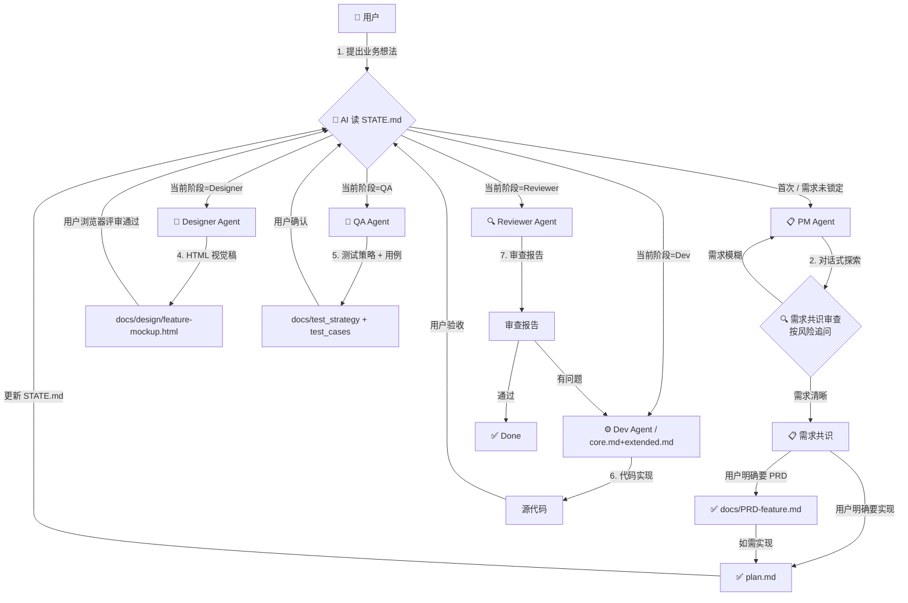

# Agent 编排协议 (Orchestration Protocol)

本文档定义 Agent 角色之间的协作流程、交接规范与数据契约。

> **核心调度模式（v2 重要变更）**
>
> 旧版（v1）：用户作为唯一调度者，手动在 Agent 之间传递上下文。
> 新版（v2）：**`docs/STATE.md` 是 single source of truth**，AI 根据 STATE.md 自动决定激活哪个角色，用户只在产物评审/争议裁决时介入。
>
> 这一变更是为了消除"每次提问都得先想清楚找谁"的认知负担。

> **工具栈适配（v3 新增）**
>
> 项目根目录的 `.harness-config.yaml` 描述本项目的工作流偏好（设计模式、测试投入、流程严格度等）。
> **所有 Agent 在动手前必须先读这个文件**，根据其中的字段调整自身行为。
> 缺失则按各 Agent 模板中的 default 值运行。
>
> 由 `setup.sh` 在首次安装时通过交互式问答生成；可通过 `.harness/setup.sh --reconfigure` 修改。

> **可观测性（v4 新增）**
>
> 每次回复的**第一行**必须输出脚手架状态行（Scaffold Status Line），让用户一眼判断 AI 有没有走脚手架。
> 格式规范如下（这是单一真相源；之前散落在 `.cursorrules` 中的"🪪 强制响应头"章节已废弃）：
>
> - `[🎭 {角色} · {feature}@{阶段} · {strictness}/{design}/{testing}]` — 正常走脚手架
> - `[⚡ 豁免 · {理由} · ...]` — 触发豁免清单
> - `[⚠️ 越阶 · ... · ...]` — 用户同意跨阶段执行
>
> Status Line 中的每个字段都必须从实际文件读出（不能填写默认值/占位符），文件缺失时用 `⚠️` 标记而非留空。

---

## 📋 所有 Agent 的通用前置动作

每个 Agent（PM / Designer / QA / Dev / Reviewer）开工前都必须：

1. **读 `.harness-config.yaml`**（v3 新增）→ 决定本 Agent 的产物形态、严格度、是否启用、**回复用什么语言**
   - `meta.language=zh` → 整个会话用简体中文回复
   - `meta.language=en` → 用英文回复
   - 缺失或无效 → 按用户当前消息语言判断
2. **读 `docs/STATE.md`** → 确认当前阶段、当前 feature 名
3. **输出 Scaffold Status Line**（v4 新增，回复第一行）→ 格式：`[🎭 {角色} · {feature}@{阶段} · {strictness}/{design}/{testing}]`
   - 若任一文件缺失，对应字段写 `⚠️ 未初始化` / `⚠️ no config`，不能填写默认值
4. **读自己负责的上游产物**（PM 读用户输入；Designer 读 PRD 或已锁定需求共识；QA 读 PRD/plan + 设计稿；Dev 读 plan；Reviewer 读代码 + plan/PRD + test_cases）
5. 工作完成后输出**交接块（Handoff Block）**，并更新 STATE.md

---

## 🔀 标准协作流程



> **⚠️ 执行门禁（v2）**：
> 1. **目标未锚定**：`architecture.md` 业务目标为占位符 → 强制 Goal Discovery（PM Agent）
> 2. **需求共识未锁定 / 分支未明确**：用户尚未确认要输出 PRD 还是 plan.md → 禁止擅自进入实现
> 3. **跨阶段意图**：用户提的问题对应的 Agent 与 STATE.md 当前阶段不一致 → AI 必须显式询问"先走完当前阶段，还是跳过？"

---

## 📦 各 Agent 的输入/输出契约

### PM Agent (`pm_agent.md`)
| 方向 | 内容 | 格式 |
|------|------|------|
| **输入** | 用户的业务想法 / 需求描述 | 自然语言 |
| **中间产物** | 需求共识（目标、边界、关键风险、分期、待确认项） | 结构化 Markdown |
| **门禁** | 用户明确选择输出 PRD 或 plan.md | 用户回复 |
| **输出 A** | `docs/PRD-<feature>.md`（可选） | 用户明确要给人类沟通时输出 |
| **输出 B** | `docs/architecture.md` 增量更新 | 仅当涉及系统级架构变更时才动 |
| **输出 C** | `TODO.md` 任务追加 + STATE.md 状态更新 | 勾选需求共识阶段，激活 PRD/Designer/Planner 分支 |

### Designer Agent (`designer_agent.md`)
| 方向 | 内容 | 格式 |
|------|------|------|
| **输入** | `docs/PRD-<feature>.md` 或已锁定需求共识 + 既有 design 资产 | Markdown + HTML/CSS |
| **输出 A** | `docs/design/<feature>-mockup.html` | **自包含 HTML 视觉稿**（CSS 内联，浏览器直开） |
| **输出 B** | `docs/design/<feature>-design-notes.md` | 设计决策、组件清单、交互流程、边界处理 |
| **门禁** | 用户在浏览器评审 mockup.html | 用户回复"设计确认" |

> **重要**：Designer 不再输出 `design_tokens.json` 作为唯一产物。
> HTML 视觉稿才是与下游 Dev Agent 对接的最自然契约——Dev 可以直接复用 HTML 中的结构与 class 命名。

### QA Agent (`qa_agent.md`)
| 方向 | 内容 | 格式 |
|------|------|------|
| **输入** | `docs/PRD-<feature>.md` 或 plan.md + `docs/design/<feature>-mockup.html`（如有） | Markdown + HTML |
| **输出 A** | `docs/test_strategy-<feature>.md` | 测试金字塔、工具选型、质量门禁 |
| **输出 B** | `docs/test_cases-<feature>.md` | 用例矩阵（正向/边界/异常） |
| **输出 C** | `TODO.md` 测试任务追加 + STATE.md 状态更新 | 勾选 QA 阶段，激活 Dev |

### Dev Agent（默认角色，规则源 = `core.md` + `extended.md`）

> 各 IDE 的入口规则文件（`.cursorrules` / `.clinerules` / `.windsurfrules` / `CLAUDE.md` / `AGENTS.md` / `.github/copilot-instructions.md` / `.trae/rules.md`）都是 `generate.sh` 从 `core.md` + `extended.md` 生成的 dist 产物——它们承载 Dev Agent 的规则，但**不是规则本身**。改规则永远改 `rules/*.md`，不要改 dist。

| 方向 | 内容 | 格式 |
|------|------|------|
| **输入** | `plan.md` + `docs/design/<feature>-*.html`（如有） + `docs/test_cases-<feature>.md`（如有） + `MEMORY.md` | Markdown + HTML + JSON |
| **输出** | 可运行的代码 + 单元测试 | 源代码 |
| **门禁** | 单元测试全绿、自验通过 | 自动 |

### Reviewer Agent (`reviewer_agent.md`)
| 方向 | 内容 | 格式 |
|------|------|------|
| **输入** | 被审查代码 + `plan.md` + `docs/PRD-<feature>.md`（如有） + `docs/test_cases-<feature>.md`（如有） | 源代码 + Markdown |
| **输出** | 结构化审查报告 → `docs/reviews/<feature>-<date>.md` | Markdown |

---

## 🚦 状态调度协议（v2 核心）

### AI 在每次回复前必须做的三步

```
1. 读 docs/STATE.md（如不存在 → 默认进入需求探讨/澄清；不要直接生成 PRD）
2. 找出 **当前阶段** 标记所在的 Agent
3. 输出 Scaffold Status Line（回复第一行，格式见本文件"可观测性 v4"章节）
4. 比对用户消息意图：
   ├─ 一致 → 直接以该 Agent 回应（Status Line 前缀 🎭）
   ├─ 跨阶段 → 反问用户（见下方话术），Status Line 前缀 ⚠️
   └─ 单点修复 / 文档 / 格式化 → 不走流程，直接动手（豁免规则，Status Line 前缀 ⚡）
```

### 跨阶段反问话术模板

```
当前流程在 [X 阶段]，[Y 产物] 还没就绪。
你的问题更像是 [Z 阶段] 的工作。三个选择：

A) 先把 [X] 走完（建议，避免下游返工）
B) 跳过 [X] 直接做 [Z]（风险：...）
C) 推翻当前流程，从需求重新审查

选哪个？或告诉我你的判断，我据此更新 STATE.md。
```

### 豁免清单（不走流程，AI 直接动手）

- 单文件 Bug 修复（明确的报错 + 明确的修复点）
- 文档更新、注释修改、Typo
- 格式化、Lint 修复
- 用户明确说"跳过审查" / "直接执行" / "全干" / "你来"
- 用户在询问而非要求执行（"这个怎么做"、"为什么会这样"）

---

## 🔄 迭代循环规则

### 需求探讨阶段（按需）
1. PM Agent 收到需求 → 按需求大小和关键风险进行对话式澄清与对抗性审查，没有固定轮数
2. 需求共识形成后，必须等待用户明确选择：输出 PRD 给人类沟通，或输出 plan.md 让 Codex/Executor 执行
3. **门禁**：需求共识未锁定、分支未明确前，禁止任何 Agent 擅自写实现代码
4. 豁免：见上方"豁免清单"

### 正常流转
1. 每个 Agent 完成产物后，**必须输出交接块**（Handoff Block，见下方）
2. 用户确认后，AI 更新 STATE.md（勾选完成阶段，激活下一阶段）
3. 下一次对话开始时，AI 自动从 STATE.md 接手，不需要用户重新指定角色

### 打回与修复
1. Reviewer 打回 → 用户将报告转交 Dev → Dev 修复 → 再审查
2. 最多循环 3 轮。第 3 轮仍未通过 → Reviewer 必须建议"重新设计" → @PM Agent
3. 如果 Designer/Dev 在做事时发现上游产物有缺 → **必须打回上游**，禁止自行脑补

### 争议升级
- 任何两个 Agent 之间的分歧 → 双方必须各自给出**具体的数据用例或代码示例**
- 用户作为最终裁决者，选择采纳哪一方

---

## 🔁 显式交接块 (Handoff Block) 标准格式

每个 Agent 完成产物后，必须在回复末尾输出：

```markdown
## 🔄 交接 (Handoff) — [当前角色] → 下一阶段

- **本阶段产出**: <产物文件路径列表>
- **请用户操作**: <用户需要做什么才能确认>
- **建议下一步**: <下一个 Agent 名>（理由）
- **可跳过条件**: <什么情况下跳过下一阶段也合理>
- **STATE.md 更新指令**: <用户确认后，AI 应该如何更新 STATE.md>
```

> 这个块是机器可读的——下次对话开始时，AI 读 STATE.md + 上一次的交接块即可无缝接手，
> 不需要用户重复解释上下文。

---

## 📁 文件系统契约

```
project-root/
├── <ide-entry-file>          # Dev Agent 入口（按 IDE 不同：.cursorrules/.clinerules/.windsurfrules/CLAUDE.md/AGENTS.md/.github/copilot-instructions.md/.trae/rules.md）
│                              # 全部由 .harness/dist/ 软链而来，源在 .harness/rules/{core,extended}.md
├── .harness-config.yaml      # ✨ v3 新增：项目级工作流配置（commit 到项目）
├── .prompts/                 # Agent 角色模板
│   ├── orchestration.md      # 本文档（编排协议 v3）
│   ├── pm_agent.md           # PM
│   ├── designer_agent.md     # Designer（支持 4 种 mode，由 .harness-config.yaml 决定）
│   ├── qa_agent.md           # QA
│   └── reviewer_agent.md     # Reviewer
├── docs/
│   ├── STATE.md              # ✨ v2：流程状态机
│   ├── PRD-<feature>.md      # ✨ v2：单需求 PRD（PM 输出）
│   ├── architecture.md       # 系统架构（仅架构级变更才动）
│   ├── design/               # Designer 产物（具体形态由 design.mode 决定）
│   │   ├── <feature>-mockup.html        # design.mode=html
│   │   ├── <feature>-design-spec.json   # design.mode=ai_tool_spec
│   │   ├── <feature>-design-brief.md    # 模式 B/C 的人读版
│   │   └── <feature>-design-notes.md    # 模式 A 的设计说明
│   ├── test_strategy-<feature>.md  # 测试策略（QA 输出，仅 testing.mode != none）
│   ├── test_cases-<feature>.md     # 测试用例（QA 输出）
│   └── reviews/<feature>-<date>.md # 审查报告（Reviewer 输出）
├── MEMORY.md                 # 项目记忆（全员可追加）
└── TODO.md                   # 任务清单
```

---

## ⚡ 快速唤起指令（仅在状态调度失效时使用）

正常情况下，AI 应根据 STATE.md 自动激活角色。仅当 AI 路由错误或你需要强制切换时，使用以下显式指令：

- **强制切到 PM**：`@pm_agent.md 我有新需求要从头审查`
- **强制切到 Designer**：`@designer_agent.md PRD 已就绪请出 HTML 视觉稿`
- **强制切到 QA**：`@qa_agent.md 请基于当前 PRD + 视觉稿出测试用例`
- **强制切到 Reviewer**：`@reviewer_agent.md 请审查以下文件：[文件列表]`
- **强制切到 Dev**：`@dev 直接开始实现，跳过流程`

---

## 🔍 Migration Note (v1 → v2)

如果你的项目里之前用的是 v1 流程：

1. 在 `docs/` 下创建 `STATE.md`（参考 `STATE.template.md`）
2. 把已有的 `architecture.md` 中的需求段落抽出来，建 `PRD-<feature>.md`
3. 如果 design 产物是 JSON tokens，**保留**它们作为跨需求复用资产；新需求按 v2 走 HTML mockup
4. `core.md` + `extended.md` 中的"角色路由"段落已升级为"状态调度"，无需手动改动（各 IDE 入口文件由 `generate.sh` 自动同步）
